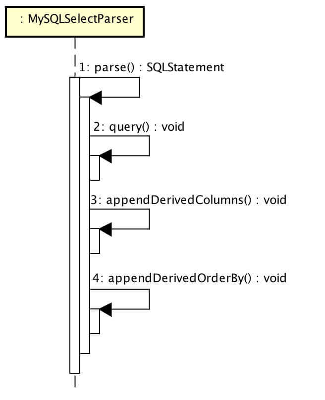
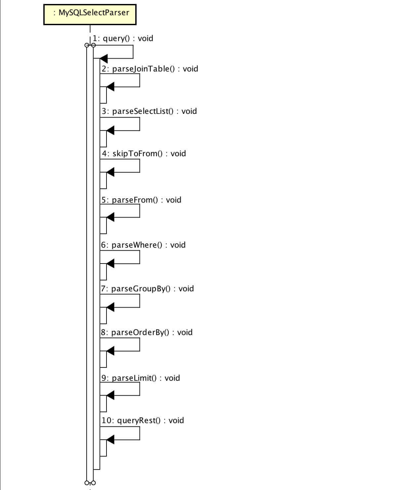
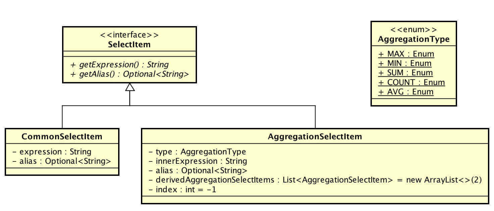
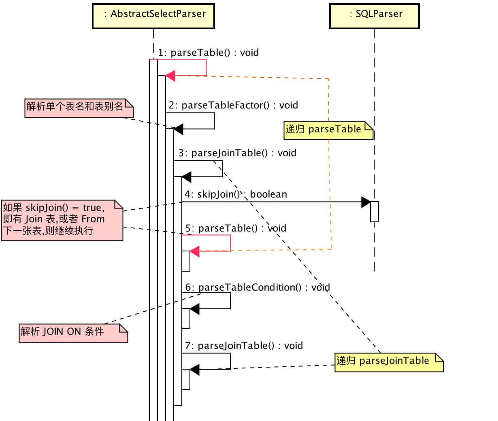

title: Sharding-JDBC 源码分析 —— SQL 解析（三）之插入SQL
date: 2017-07-27
tags:
categories: Sharding-JDBC
permalink: Sharding-JDBC/sql-parse-3

-------


> 🙂🙂🙂关注**微信公众号：【芋艿的后端小屋】**有福利：  
> 1. RocketMQ / MyCAT / Sharding-JDBC **所有**源码分析文章列表  
> 2. RocketMQ / MyCAT / Sharding-JDBC **中文注释源码 GitHub 地址**  
> 3. 您对于源码的疑问每条留言**都**将得到**认真**回复。**甚至不知道如何读源码也可以请教噢**。  
> 4. **新的**源码解析文章**实时**收到通知。**每周更新一篇左右**。
> 5. **认真的**源码交流微信群。

-------

-------

# 1. 概述

本文前置阅读：

* [《SQL 解析（一）之词法解析》](http://www.yunai.me/Sharding-JDBC/sql-parse-1/?self)
* [《SQL 解析（二）之SQL解析》](http://www.yunai.me/Sharding-JDBC/sql-parse-2/?self)

本文分享**插入SQL解析**的源码实现。每个数据库都有自己的 SELECT 语句的解析器实现方式，我们主要分析大家最常用的 MySQL。大体流程如下：



```Java
// AbstractSelectParser.java
public final SelectStatement parse() {
   query();
   parseOrderBy();
   customizedSelect();
   appendDerivedColumns();
   appendDerivedOrderBy();
   return selectStatement;
}
```

* `parseOrderBy()` ：对于 MySQL SELECT 语句无效果，进行省略。
* `customizedSelect()` ：Oracle、SQLServer 重写了该方法，对于 MySQL 是个空方法，进行省略。有兴趣的同学可以单独去研究研究。

# 2. SelectStatement

🙂 **本节只介绍这些类，解析源码我们在本文下节分享。** 🙂  
🙂 **本节只介绍这些类，解析源码我们在本文下节分享。** 🙂  
🙂 **本节只介绍这些类，解析源码我们在本文下节分享。** 🙂  

SelectStatement，SELECT SQL 语句解析结果对象。

```Java
// SelectStatement.java
public final class SelectStatement extends AbstractSQLStatement {
    /**
     * 是否行 DISTINCT / DISTINCTROW / UNION
     */
    private boolean distinct;
    /**
     * 是否查询所有字段，即 SELECT *
     */
    private boolean containStar;
    /**
     * 最后一个查询项下一个 Token 的开始位置
     *
     * @see #items
     */
    private int selectListLastPosition;
    /**
     * 最后一个分组项下一个 Token 的开始位置
     */
    private int groupByLastPosition;
    /**
     * 查询项
     */
    private final List<SelectItem> items = new LinkedList<>();
    /**
     * 分组项
     */
    private final List<OrderItem> groupByItems = new LinkedList<>();
    /**
     * 排序项
     */
    private final List<OrderItem> orderByItems = new LinkedList<>();
    /**
     * 分页
     */
    private Limit limit;
}
```

我们对属性按照类型进行归类：

* 特殊
    * distinct 
* 查询字段
    * containStar
    * items
    * selectListLastPosition
* 分组
    * groupByItems
    * groupByLastPosition
* 排序
    * orderByItems
* 分页
    * limit

## 2.1 AbstractSQLStatement

```Java
public abstract class AbstractSQLStatement implements SQLStatement {
    /**
     * SQL 类型
     */
    private final SQLType type;
    /**
     * 表
     */
    private final Tables tables = new Tables();
    /**
     * 过滤条件。
     * 只有对路由结果有影响的条件，才添加进数组
     */
    private final Conditions conditions = new Conditions();
    /**
     * SQL标记对象
     */
    private final List<SQLToken> sqlTokens = new LinkedList<>();
}
```

## 2.2 SQLToken

SQLToken，SQL标记对象。

| 类 | 说明 |
| :--- | :--- |
| GeneratedKeyToken | 自增主键标记对象 |
| TableToken | 表标记对象 |
| ItemsToken | 选择项标记对象 |
| OffsetToken | 分页偏移量标记对象 |
| OrderByToken | 排序标记对象 |
| RowCountToken | 分页长度标记对象 |

# 3. #query()

`#query()`，查询 SQL 解析。

**MySQL SELECT Syntax**：

```SQL
// https://dev.mysql.com/doc/refman/5.7/en/select.html
SELECT
    [ALL | DISTINCT | DISTINCTROW ]
      [HIGH_PRIORITY]
      [STRAIGHT_JOIN]
      [SQL_SMALL_RESULT] [SQL_BIG_RESULT] [SQL_BUFFER_RESULT]
      [SQL_CACHE | SQL_NO_CACHE] [SQL_CALC_FOUND_ROWS]
    select_expr [, select_expr ...]
    [FROM table_references
      [PARTITION partition_list]
    [WHERE where_condition]
    [GROUP BY {col_name | expr | position}
      [ASC | DESC], ... [WITH ROLLUP]]
    [HAVING where_condition]
    [ORDER BY {col_name | expr | position}
      [ASC | DESC], ...]
    [LIMIT {[offset,] row_count | row_count OFFSET offset}]
    [PROCEDURE procedure_name(argument_list)]
    [INTO OUTFILE 'file_name'
        [CHARACTER SET charset_name]
        export_options
      | INTO DUMPFILE 'file_name'
      | INTO var_name [, var_name]]
    [FOR UPDATE | LOCK IN SHARE MODE]]
```

流程如下：



代码如下：

```Java
// MySQLSelectParser.java
public void query() {
   if (getSqlParser().equalAny(DefaultKeyword.SELECT)) {
       getSqlParser().getLexer().nextToken();
       parseDistinct();
       getSqlParser().skipAll(MySQLKeyword.HIGH_PRIORITY, DefaultKeyword.STRAIGHT_JOIN, MySQLKeyword.SQL_SMALL_RESULT, MySQLKeyword.SQL_BIG_RESULT, MySQLKeyword.SQL_BUFFER_RESULT,
               MySQLKeyword.SQL_CACHE, MySQLKeyword.SQL_NO_CACHE, MySQLKeyword.SQL_CALC_FOUND_ROWS);
       // 解析 查询字段
       parseSelectList();
       // 跳到 FROM 处
       skipToFrom();
   }
   // 解析 表（JOIN ON / FROM 单&多表）
   parseFrom();
   // 解析 WHERE 条件
   parseWhere();
   // 解析 Group By 和 Having（目前不支持）条件
   parseGroupBy();
   // 解析 Order By 条件
   parseOrderBy();
   // 解析 分页 Limit 条件
   parseLimit();
   // [PROCEDURE] 暂不支持
   if (getSqlParser().equalAny(DefaultKeyword.PROCEDURE)) {
       throw new SQLParsingUnsupportedException(getSqlParser().getLexer().getCurrentToken().getType());
   }
   queryRest();
}
```

## 3.1 #parseDistinct() 

解析 DISTINCT、DISTINCTROW、UNION 谓语。

核心代码：

```Java
// AbstractSelectParser.java
protected final void parseDistinct() {
   if (sqlParser.equalAny(DefaultKeyword.DISTINCT, DefaultKeyword.DISTINCTROW, DefaultKeyword.UNION)) {
       selectStatement.setDistinct(true);
       sqlParser.getLexer().nextToken();
       if (hasDistinctOn() && sqlParser.equalAny(DefaultKeyword.ON)) { // PostgreSQL 独有语法： DISTINCT ON
           sqlParser.getLexer().nextToken();
           sqlParser.skipParentheses();
       }
   } else if (sqlParser.equalAny(DefaultKeyword.ALL)) {
       sqlParser.getLexer().nextToken();
   }
}
```

此处的 DISTINCT 和我们常用的 DISTINCT(字段) 不同，它是针对查询结果做去重，即整行重复。举个例子：

```SQL
mysql> SELECT item_id, order_id FROM t_order_item;
+---------+----------+
| item_id | order_id |
+---------+----------+
| 1       | 1        |
| 1       | 1        |
+---------+----------+
2 rows in set (0.03 sec)

mysql> SELECT DISTINCT item_id, order_id FROM t_order_item;
+---------+----------+
| item_id | order_id |
+---------+----------+
| 1       | 1        |
+---------+----------+
1 rows in set (0.02 sec)
```

## 3.2 #parseSelectList()

| SELECT | o.user_id  | COUNT(DISTINCT i.item_id) AS item_count | MAX(i.item_id) | FROM |
| --- | --- | --- | --- | --- |
|  | SelectItem | SelectItem | SelectItem |  |

将 SQL **查询字段** 按照**逗号( , )**切割成多个选择项( SelectItem)。核心代码如下：

```Java
// AbstractSelectParser.java
protected final void parseSelectList() {
   do {
       // 解析 选择项
       parseSelectItem();
   } while (sqlParser.skipIfEqual(Symbol.COMMA));
   // 设置 最后一个查询项下一个 Token 的开始位置
   selectStatement.setSelectListLastPosition(sqlParser.getLexer().getCurrentToken().getEndPosition() - sqlParser.getLexer().getCurrentToken().getLiterals().length());
}
```

### 3.2.1 SelectItem 选择项

SelectItem 是一个接口，有 2 个实现类：

* CommonSelectItem ：通用选择项
* AggregationSelectItem ：聚合选择项



解析单个 SelectItem 核心代码：

```Java
// AbstractSelectParser.java
private void parseSelectItem() {
   // 第四种情况，SQL Server 独有
   if (isRowNumberSelectItem()) {
       selectStatement.getItems().add(parseRowNumberSelectItem());
       return;
   }
   sqlParser.skipIfEqual(DefaultKeyword.CONNECT_BY_ROOT); // Oracle 独有：https://docs.oracle.com/cd/B19306_01/server.102/b14200/operators004.htm
   String literals = sqlParser.getLexer().getCurrentToken().getLiterals();
   // 第一种情况，* 通用选择项，SELECT *
   if (sqlParser.equalAny(Symbol.STAR) || Symbol.STAR.getLiterals().equals(SQLUtil.getExactlyValue(literals))) {
       sqlParser.getLexer().nextToken();
       selectStatement.getItems().add(new CommonSelectItem(Symbol.STAR.getLiterals(), sqlParser.parseAlias()));
       selectStatement.setContainStar(true);
       return;
   }
   // 第二种情况，聚合选择项
   if (sqlParser.skipIfEqual(DefaultKeyword.MAX, DefaultKeyword.MIN, DefaultKeyword.SUM, DefaultKeyword.AVG, DefaultKeyword.COUNT)) {
       selectStatement.getItems().add(new AggregationSelectItem(AggregationType.valueOf(literals.toUpperCase()), sqlParser.skipParentheses(), sqlParser.parseAlias()));
       return;
   }
   // 第三种情况，非 * 通用选择项
   StringBuilder expression = new StringBuilder();
   Token lastToken = null;
   while (!sqlParser.equalAny(DefaultKeyword.AS) && !sqlParser.equalAny(Symbol.COMMA) && !sqlParser.equalAny(DefaultKeyword.FROM) && !sqlParser.equalAny(Assist.END)) {
       String value = sqlParser.getLexer().getCurrentToken().getLiterals();
       int position = sqlParser.getLexer().getCurrentToken().getEndPosition() - value.length();
       expression.append(value);
       lastToken = sqlParser.getLexer().getCurrentToken();
       sqlParser.getLexer().nextToken();
       if (sqlParser.equalAny(Symbol.DOT)) {
           selectStatement.getSqlTokens().add(new TableToken(position, value));
       }
   }
   // 不带 AS，并且有别名，并且别名不等于自己（tips：这里重点看。判断这么复杂的原因：防止substring操作截取结果错误）
   if (null != lastToken && Literals.IDENTIFIER == lastToken.getType()
           && !isSQLPropertyExpression(expression, lastToken) // 过滤掉，别名是自己的情况【1】（例如，SELECT u.user_id u.user_id FROM t_user）
           && !expression.toString().equals(lastToken.getLiterals())) { // 过滤掉，无别名的情况【2】（例如，SELECT user_id FROM t_user）
       selectStatement.getItems().add(
               new CommonSelectItem(SQLUtil.getExactlyValue(expression.substring(0, expression.lastIndexOf(lastToken.getLiterals()))), Optional.of(lastToken.getLiterals())));
       return;
   }
   // 带 AS（例如，SELECT user_id AS userId） 或者 无别名（例如，SELECT user_id）
   selectStatement.getItems().add(new CommonSelectItem(SQLUtil.getExactlyValue(expression.toString()), sqlParser.parseAlias()));
}
```

一共分成 4 种大的情况，我们来逐条梳理：

* 第一种：**`*` 通用选择项**：   
例如，`SELECT * FROM t_user` 的 `*`。  
为什么要加   `Symbol.STAR.getLiterals().equals(SQLUtil.getExactlyValue(literals))` 判断呢？  

```SQL
SELECT `*` FROM t_user; // 也能达到查询所有字段的效果
```
* 第二种：**聚合选择项**：  
例如，`SELECT COUNT(user_id) FROM t_user` 的 `COUNT(user_id)`。

解析结果 AggregationSelectItem：  


`sqlParser.skipParentheses()` 解析见[《SQL 解析（二）之SQL解析》的AbstractParser小节](http://www.yunai.me/Sharding-JDBC/sql-parse-2/?self)。

* 第三种：**非 `*` 通用选择项**：

例如，`SELECT user_id FROM t_user`。

从实现上，逻辑会复杂很多。第一种，可以根据 `*` 做字段判断；第二种，可以使用 `(` 和 `)` 做字段判断。能够判断一个**包含别名的** SelectItem 结束有 4 种 Token，根据结束方式我们分成 2 种：

* DefaultKeyword.AS ：能够接触出 SelectItem 表达式，**即不包含别名**。例如，`SELECT user_id AS uid FROM t_user`，能够直接解析出 `user_id`。
* Symbol.COMMA / DefaultKeyword.FROM / Assist.END ：**包含别名**。例如，`SELECT user_id uid FROM t_user`，解析结果为 `user_id uid`。

基于这个在配合上面的代码注释，大家再重新理解下怎么解析第三种情况。

* 第四种：SQLServer ROW_NUMBER：

ROW_NUMBER 是 SQLServer 独有的。由于本文大部分的读者使用的 MySQL / Oracle，就不分析了。有兴趣的同学可以看 [SQLServerSelectParser#parseRowNumberSelectItem()](https://github.com/dangdangdotcom/sharding-jdbc/blob/9354031743b63e44cbded5618980ae71a15f0260/sharding-jdbc-core/src/main/java/com/dangdang/ddframe/rdb/sharding/parsing/parser/dialect/sqlserver/SQLServerSelectParser.java) 方法。

### 3.2.2 #parseAlias() 解析别名

解析别名，分成是否带 `AS` 两种情况。解析代码：[《SQL 解析（二）之SQL解析》的#parseAlias()小节](http://www.yunai.me/Sharding-JDBC/sql-parse-2/?self)。

### 3.2.3 TableToken 表标记对象

TableToken，记录表名在 SQL 里出现的**位置**和**名字**。

```Java
// TableToken.java
public final class TableToken implements SQLToken {
    /**
     * 开始位置
     */
    private final int beginPosition;
    /**
     * 表达式
     */
    private final String originalLiterals;
    
    /**
     * 获取表名称.
     * 
     * @return 表名称
     */
    public String getTableName() {
        return SQLUtil.getExactlyValue(originalLiterals);
    }
}
```

例如上文第三种情况。


## 3.3 #skipToFrom()

```Java
/**
* 跳到 FROM 处
*/
private void skipToFrom() {
   while (!getSqlParser().equalAny(DefaultKeyword.FROM) && !getSqlParser().equalAny(Assist.END)) {
       getSqlParser().getLexer().nextToken();
   }
}
```

## 3.4 #parseFrom()

解析单个表名和表别名。

**MySQL JOIN Syntax**：

```SQL
// https://dev.mysql.com/doc/refman/5.7/en/join.html
table_references:
    escaped_table_reference [, escaped_table_reference] ...

escaped_table_reference:
    table_reference
  | { OJ table_reference }

table_reference:
    table_factor
  | join_table

table_factor:
    tbl_name [PARTITION (partition_names)]
        [[AS] alias] [index_hint_list]
  | table_subquery [AS] alias
  | ( table_references )

join_table:
    table_reference [INNER | CROSS] JOIN table_factor [join_condition]
  | table_reference STRAIGHT_JOIN table_factor
  | table_reference STRAIGHT_JOIN table_factor ON conditional_expr
  | table_reference {LEFT|RIGHT} [OUTER] JOIN table_reference join_condition
  | table_reference NATURAL [{LEFT|RIGHT} [OUTER]] JOIN table_factor

join_condition:
    ON conditional_expr
  | USING (column_list)

index_hint_list:
    index_hint [, index_hint] ...

index_hint:
    USE {INDEX|KEY}
      [FOR {JOIN|ORDER BY|GROUP BY}] ([index_list])
  | IGNORE {INDEX|KEY}
      [FOR {JOIN|ORDER BY|GROUP BY}] (index_list)
  | FORCE {INDEX|KEY}
      [FOR {JOIN|ORDER BY|GROUP BY}] (index_list)

index_list:
    index_name [, index_name] ...
```

### 3.4.1 JOIN ON / FROM TABLE

先抛开**子查询**的情况，只考虑如下两种 SQL 情况。

```SQL
// JOIN ON ： 实际可以继续 JOIN ON 更多表
SELECT * FROM t_order o JOIN t_order_item i ON o.order_id = i.order_id; 
// FROM 多表 ：实际可以继续 FROM 多更表
SELECT * FROM t_order o, t_order_item i 
```

在看实现代码之前，先一起看下调用顺序图：



看懂上图后，来继续看下实现代码（🙂**代码有点多，不要方！**）：

```Java
// AbstractSelectParser.class
/**
* 解析所有表名和表别名
*/
public final void parseFrom() {
   if (sqlParser.skipIfEqual(DefaultKeyword.FROM)) {
       parseTable();
   }
}
/**
* 解析所有表名和表别名
*/
public void parseTable() {
   // 解析子查询
   if (sqlParser.skipIfEqual(Symbol.LEFT_PAREN)) {
       if (!selectStatement.getTables().isEmpty()) {
           throw new UnsupportedOperationException("Cannot support subquery for nested tables.");
       }
       selectStatement.setContainStar(false); // TODO 疑问
       // 去掉子查询左括号
       sqlParser.skipUselessParentheses();
       // 解析子查询 SQL
       parse();
       // 去掉子查询右括号
       sqlParser.skipUselessParentheses();
       //
       if (!selectStatement.getTables().isEmpty()) {
           return;
       }
   }
   // 解析当前表
   parseTableFactor();
   // 解析下一个表
   parseJoinTable();
}
/**
* 解析单个表名和表别名
*/
protected final void parseTableFactor() {
   int beginPosition = sqlParser.getLexer().getCurrentToken().getEndPosition() - sqlParser.getLexer().getCurrentToken().getLiterals().length();
   String literals = sqlParser.getLexer().getCurrentToken().getLiterals();
   sqlParser.getLexer().nextToken();
   // TODO 包含Schema解析
   if (sqlParser.skipIfEqual(Symbol.DOT)) { // https://dev.mysql.com/doc/refman/5.7/en/information-schema.html ：SELECT table_name, table_type, engine FROM information_schema.tables
       sqlParser.getLexer().nextToken();
       sqlParser.parseAlias();
       return;
   }
   // FIXME 根据shardingRule过滤table
   selectStatement.getSqlTokens().add(new TableToken(beginPosition, literals));
   // 表 以及 表别名
   selectStatement.getTables().add(new Table(SQLUtil.getExactlyValue(literals), sqlParser.parseAlias()));
}
/**
* 解析 Join Table 或者 FROM 下一张 Table
*/
protected void parseJoinTable() {
   if (sqlParser.skipJoin()) {
       // 这里调用 parseJoinTable() 而不是 parseTableFactor() ：下一个 Table 可能是子查询
       // 例如：SELECT * FROM t_order JOIN (SELECT * FROM t_order_item JOIN t_order_other ON ) .....
       parseTable();
       if (sqlParser.skipIfEqual(DefaultKeyword.ON)) { // JOIN 表时 ON 条件
           do {
               parseTableCondition(sqlParser.getLexer().getCurrentToken().getEndPosition());
               sqlParser.accept(Symbol.EQ);
               parseTableCondition(sqlParser.getLexer().getCurrentToken().getEndPosition() - sqlParser.getLexer().getCurrentToken().getLiterals().length());
           } while (sqlParser.skipIfEqual(DefaultKeyword.AND));
       } else if (sqlParser.skipIfEqual(DefaultKeyword.USING)) { // JOIN 表时 USING 为使用两表相同字段相同时对 ON 的简化。例如以下两条 SQL 等价：
                                                                   // SELECT * FROM t_order o JOIN t_order_item i USING (order_id);
                                                                   // SELECT * FROM t_order o JOIN t_order_item i ON o.order_id = i.order_id
           sqlParser.skipParentheses();
       }
       parseJoinTable(); // 继续递归
   }
}
/**
* 解析 ON 条件里的 TableToken
*
* @param startPosition 开始位置
*/
private void parseTableCondition(final int startPosition) {
   SQLExpression sqlExpression = sqlParser.parseExpression();
   if (!(sqlExpression instanceof SQLPropertyExpression)) {
       return;
   }
   SQLPropertyExpression sqlPropertyExpression = (SQLPropertyExpression) sqlExpression;
   if (selectStatement.getTables().getTableNames().contains(SQLUtil.getExactlyValue(sqlPropertyExpression.getOwner().getName()))) {
       selectStatement.getSqlTokens().add(new TableToken(startPosition, sqlPropertyExpression.getOwner().getName()));
   }
}
```

OK，递归因为平时日常中写的比较少，可能理解起来可能会困难一些，努力看懂！🙂**如果真的看不懂，可以加微信公众号（芋艿的后端小屋），我来帮你一起理解。**

### 3.4.2 子查询

Sharding-JDBC 目前支持**第一个**包含多层级的数据子查询。例如：

```SQL
SELECT o3.* FROM (SELECT * FROM (SELECT * FROM t_order o) o2) o3;
SELECT o3.* FROM (SELECT * FROM (SELECT * FROM t_order o) o2) o3 JOIN t_order_item i ON o3.order_id = i.order_id;
```

不支持**第二个开始**包含多层级的数据子查询。例如：

```SQL
SELECT o3.* FROM t_order_item i JOIN (SELECT * FROM (SELECT * FROM t_order o) o2) o3 ON o3.order_id = i.order_id; // 此条 SQL 是上面第二条 SQL 左右量表颠倒
SELECT COUNT(*) FROM (SELECT * FROM t_order o WHERE o.id IN (SELECT id FROM t_order WHERE status = ?)) // FROM 官方不支持 SQL 举例
```

使用**第二个开始**的子查询会抛出异常，代码如下：

```
// AbstractSelectParser.java#parseTable()片段
if (!selectStatement.getTables().isEmpty()) {
    throw new UnsupportedOperationException("Cannot support subquery for nested tables.");
}
```

使用子查询，建议认真阅读官方[《分页及子查询》](http://dangdangdotcom.github.io/sharding-jdbc/02-guide/subquery/)文档。

### 3.4.3 #parseJoinTable()

MySQLSelectParser 重写了 `#parseJoinTable()` 用于解析 USE / IGNORE / FORCE index_hint。具体语法见上文 **JOIN Syntax**。这里就不做解析，有兴趣的同学可以去看看。

### 3.4.4 Tables 表集合对象

```Java
// Tables.java
public final class Tables {
    private final List<Table> tables = new ArrayList<>();
}

// Table.java
public final class Table {
    /**
     * 表
     */
    private final String name;
    /**
     * 别名
     */
    private final Optional<String> alias;
}

// AbstractSelectParser.java#parseTableFactor()片段
selectStatement.getTables().add(new Table(SQLUtil.getExactlyValue(literals), sqlParser.parseAlias()));
```

## 3.5 #parseWhere()

解析 WHERE 条件。解析代码：[《SQL 解析（二）之SQL解析》的#parseWhere()小节](http://www.yunai.me/Sharding-JDBC/sql-parse-2/?self)。

## 3.6 #parseGroupBy()

解析分组条件，实现上比较类似查询字段，更简单一些。

```Java
// AbstractSelectParser.java
/**
* 解析 Group By 和 Having（暂时不支持）
*/
protected void parseGroupBy() {
   if (sqlParser.skipIfEqual(DefaultKeyword.GROUP)) {
       sqlParser.accept(DefaultKeyword.BY);
       // 解析 Group By 每个字段
       while (true) {
           addGroupByItem(sqlParser.parseExpression(selectStatement));
           if (!sqlParser.equalAny(Symbol.COMMA)) {
               break;
           }
           sqlParser.getLexer().nextToken();
       }
       while (sqlParser.equalAny(DefaultKeyword.WITH) || sqlParser.getLexer().getCurrentToken().getLiterals().equalsIgnoreCase("ROLLUP")) {
           sqlParser.getLexer().nextToken();
       }
       // Having（暂时不支持）
       if (sqlParser.skipIfEqual(DefaultKeyword.HAVING)) {
           throw new UnsupportedOperationException("Cannot support Having");
       }
       selectStatement.setGroupByLastPosition(sqlParser.getLexer().getCurrentToken().getEndPosition());
   } else if (sqlParser.skipIfEqual(DefaultKeyword.HAVING)) {
       throw new UnsupportedOperationException("Cannot support Having");
   }
}
/**
* 解析 Group By 单个字段
* Group By 条件是带有排序功能，默认ASC
*
* @param sqlExpression 表达式
*/
protected final void addGroupByItem(final SQLExpression sqlExpression) {
   // Group By 字段 DESC / ASC / ;默认是 ASC。
   OrderType orderByType = OrderType.ASC;
   if (sqlParser.equalAny(DefaultKeyword.ASC)) {
       sqlParser.getLexer().nextToken();
   } else if (sqlParser.skipIfEqual(DefaultKeyword.DESC)) {
       orderByType = OrderType.DESC;
   }
   // 解析 OrderItem
   OrderItem orderItem;
   if (sqlExpression instanceof SQLPropertyExpression) {
       SQLPropertyExpression sqlPropertyExpression = (SQLPropertyExpression) sqlExpression;
       orderItem = new OrderItem(SQLUtil.getExactlyValue(sqlPropertyExpression.getOwner().getName()), SQLUtil.getExactlyValue(sqlPropertyExpression.getName()), orderByType,
               getAlias(SQLUtil.getExactlyValue(sqlPropertyExpression.getOwner() + "." + SQLUtil.getExactlyValue(sqlPropertyExpression.getName()))));
   } else if (sqlExpression instanceof SQLIdentifierExpression) {
       SQLIdentifierExpression sqlIdentifierExpression = (SQLIdentifierExpression) sqlExpression;
       orderItem = new OrderItem(SQLUtil.getExactlyValue(sqlIdentifierExpression.getName()), orderByType, getAlias(SQLUtil.getExactlyValue(sqlIdentifierExpression.getName())));
   } else {
       return;
   }
   selectStatement.getGroupByItems().add(orderItem);
}
/**
* 字段在查询项里的别名
*
* @param name 字段
* @return 别名
*/
private Optional<String> getAlias(final String name) {
   if (selectStatement.isContainStar()) {
       return Optional.absent();
   }
   String rawName = SQLUtil.getExactlyValue(name);
   for (SelectItem each : selectStatement.getItems()) {
       if (rawName.equalsIgnoreCase(SQLUtil.getExactlyValue(each.getExpression()))) {
           return each.getAlias();
       }
       if (rawName.equalsIgnoreCase(each.getAlias().orNull())) {
           return Optional.of(rawName);
       }
   }
   return Optional.absent();
}
```

### 3.6.1 OrderItem 排序项

```Java
public final class OrderItem {
    /**
    * 所属表别名
    */
    private final Optional<String> owner;
    /**
    * 排序字段
    */
    private final Optional<String> name;
    /**
    * 排序类型
    */
    private final OrderType type;
    /**
    * 按照第几个查询字段排序
    * ORDER BY 数字 的 数字代表的是第几个字段
    */
    @Setter
    private int index = -1;
    /**
    * 字段在查询项({@link com.dangdang.ddframe.rdb.sharding.parsing.parser.context.selectitem.SelectItem} 的别名
    */
    @Setter
    private Optional<String> alias;
}
```

## 3.7 #parseOrderBy()

解析排序条件。实现逻辑类似 `#parseGroupBy()`，这里就不做解析，有兴趣的同学可以去看看。

## 3.8 #parseLimit()

解析分页 Limit 条件。相对简单，这里就不做解析，有兴趣的同学可以去看看。注意下，分成 3 种情况：

* LIMIT row_count
* LIMIT offset, row_count
* LIMIT row_count OFFSET offset

### 3.8.1 Limit

分页对象。

```Java
// Limit.java
public final class Limit {

    /**
     * 是否重写rowCount
     * TODO 待补充：预计和内存分页合并有关
     */
    private final boolean rowCountRewriteFlag;
    /**
     * offset
     */
    private LimitValue offset;
    /**
     * row
     */
    private LimitValue rowCount;
}

// LimitValue.java
public final class LimitValue {
    /**
     * 值
     * 当 value == -1 时，为占位符
     */
    private int value;
    /**
     * 第几个占位符
     */
    private int index;
}
```

### 3.8.2 OffsetToken RowCountToken

* OffsetToken：分页偏移量标记对象
* RowCountToken：分页长度标记对象

**只有在对应位置非占位符才有该 SQLToken**。

```Java
// OffsetToken.java
public final class OffsetToken implements SQLToken {
    /**
     * SQL 所在开始位置
     */
    private final int beginPosition;
    /**
     * 偏移值
     */
    private final int offset;
}

// RowCountToken.java
public final class RowCountToken implements SQLToken {
    /**
     * SQL 所在开始位置
     */
    private final int beginPosition;
    /**
     * 行数
     */
    private final int rowCount;
}
```

## 3.9 #queryRest()

```Java
// AbstractSelectParser.java
protected void queryRest() {
   if (sqlParser.equalAny(DefaultKeyword.UNION, DefaultKeyword.EXCEPT, DefaultKeyword.INTERSECT, DefaultKeyword.MINUS)) {
       throw new SQLParsingUnsupportedException(sqlParser.getLexer().getCurrentToken().getType());
   }
}
```

不支持 UNION / EXCEPT / INTERSECT / MINUS ，调用会抛出异常。

# 4. appendDerived等方法

因为 Sharding-JDBC 对表做了分片，在 AVG , GROUP BY , ORDER BY 需要对 SQL 进行一些改写，以达到能在内存里对结果做进一步处理，例如求平均值、分组、排序等。

😈：打起精神，此块是非常有趣的。

##  4.1 appendAvgDerivedColumns

解决 AVG 查询。

```Java
// AbstractSelectParser.java
/**
* 针对 AVG 聚合字段，增加推导字段
* AVG 改写成 SUM + COUNT 查询，内存计算出 AVG 结果。
*
* @param itemsToken 选择项标记对象
*/
private void appendAvgDerivedColumns(final ItemsToken itemsToken) {
   int derivedColumnOffset = 0;
   for (SelectItem each : selectStatement.getItems()) {
       if (!(each instanceof AggregationSelectItem) || AggregationType.AVG != ((AggregationSelectItem) each).getType()) {
           continue;
       }
       AggregationSelectItem avgItem = (AggregationSelectItem) each;
       // COUNT 字段
       String countAlias = String.format(DERIVED_COUNT_ALIAS, derivedColumnOffset);
       AggregationSelectItem countItem = new AggregationSelectItem(AggregationType.COUNT, avgItem.getInnerExpression(), Optional.of(countAlias));
       // SUM 字段
       String sumAlias = String.format(DERIVED_SUM_ALIAS, derivedColumnOffset);
       AggregationSelectItem sumItem = new AggregationSelectItem(AggregationType.SUM, avgItem.getInnerExpression(), Optional.of(sumAlias));
       // AggregationSelectItem 设置
       avgItem.getDerivedAggregationSelectItems().add(countItem);
       avgItem.getDerivedAggregationSelectItems().add(sumItem);
       // TODO 将AVG列替换成常数，避免数据库再计算无用的AVG函数
       // ItemsToken
       itemsToken.getItems().add(countItem.getExpression() + " AS " + countAlias + " ");
       itemsToken.getItems().add(sumItem.getExpression() + " AS " + sumAlias + " ");
       //
       derivedColumnOffset++;
   }
}
```

## 4.2 appendDerivedOrderColumns

解决 GROUP BY , ORDER BY。

```Java
// AbstractSelectParser.java
/**
* 针对 GROUP BY 或 ORDER BY 字段，增加推导字段
* 如果该字段不在查询字段里，需要额外查询该字段，这样才能在内存里 GROUP BY 或 ORDER BY
*
* @param itemsToken 选择项标记对象
* @param orderItems 排序字段
* @param aliasPattern 别名模式
*/
private void appendDerivedOrderColumns(final ItemsToken itemsToken, final List<OrderItem> orderItems, final String aliasPattern) {
   int derivedColumnOffset = 0;
   for (OrderItem each : orderItems) {
       if (!isContainsItem(each)) {
           String alias = String.format(aliasPattern, derivedColumnOffset++);
           each.setAlias(Optional.of(alias));
           itemsToken.getItems().add(each.getQualifiedName().get() + " AS " + alias + " ");
       }
   }
}
/**
* 查询字段是否包含排序字段
*
* @param orderItem 排序字段
* @return 是否
*/
private boolean isContainsItem(final OrderItem orderItem) {
   if (selectStatement.isContainStar()) { // SELECT *
       return true;
   }
   for (SelectItem each : selectStatement.getItems()) {
       if (-1 != orderItem.getIndex()) { // ORDER BY 使用数字
           return true;
       }
       if (each.getAlias().isPresent() && orderItem.getAlias().isPresent() && each.getAlias().get().equalsIgnoreCase(orderItem.getAlias().get())) { // 字段别名比较
           return true;
       }
       if (!each.getAlias().isPresent() && orderItem.getQualifiedName().isPresent() && each.getExpression().equalsIgnoreCase(orderItem.getQualifiedName().get())) { // 字段原名比较
           return true;
       }
   }
   return false;
}
```

## 4.3 ItemsToken

选择项标记对象。目前有 3 个情况会产生：

1. `AVG` 查询额外 COUNT 和 SUM：`#appendAvgDerivedColumns()`
2. `GROUP BY` 不在 查询字段，额外查询该字段 ：`#appendDerivedOrderColumns()`
3. `ORDER BY` 不在 查询字段，额外查询该字段 ：`#appendDerivedOrderColumns()`

```Java
// ItemsToken.java
public final class ItemsToken implements SQLToken {

    /**
     * SQL 开始位置
     */
    private final int beginPosition;
    /**
     * 字段名数组
     */
    private final List<String> items = new LinkedList<>();
}
```

## 4.4 appendDerivedOrderBy()

当 SQL 有聚合条件而无排序条件，根据聚合条件进行排序。这是数据库自己的执行规则。

```SQL
mysql> SELECT order_id FROM t_order GROUP BY order_id;
+----------+
| order_id |
+----------+
| 1        |
| 2        |
| 3        |
| 4        |
+----------+
4 rows in set (0.05 sec)

mysql> SELECT order_id FROM t_order GROUP BY order_id DESC;
+----------+
| order_id |
+----------+
| 4        |
| 3        |
| 2        |
| 1        |
+----------+
4 rows in set (0.02 sec)
```

```JAVA
// AbstractSelectParser.java
/**
* 当无 Order By 条件时，使用 Group By 作为排序条件（数据库本身规则）
*/
private void appendDerivedOrderBy() {
   if (!getSelectStatement().getGroupByItems().isEmpty() && getSelectStatement().getOrderByItems().isEmpty()) {
       getSelectStatement().getOrderByItems().addAll(getSelectStatement().getGroupByItems());
       getSelectStatement().getSqlTokens().add(new OrderByToken(getSelectStatement().getGroupByLastPosition()));
   }
}
```

### 4.3.1 OrderByToken

排序标记对象。当无 Order By 条件时，使用 Group By 作为排序条件（数据库本身规则）。

```Java
// OrderByToken.java
public final class OrderByToken implements SQLToken {
    /**
     * SQL 所在开始位置
     */
    private final int beginPosition;
}
```

# 7. 彩蛋


