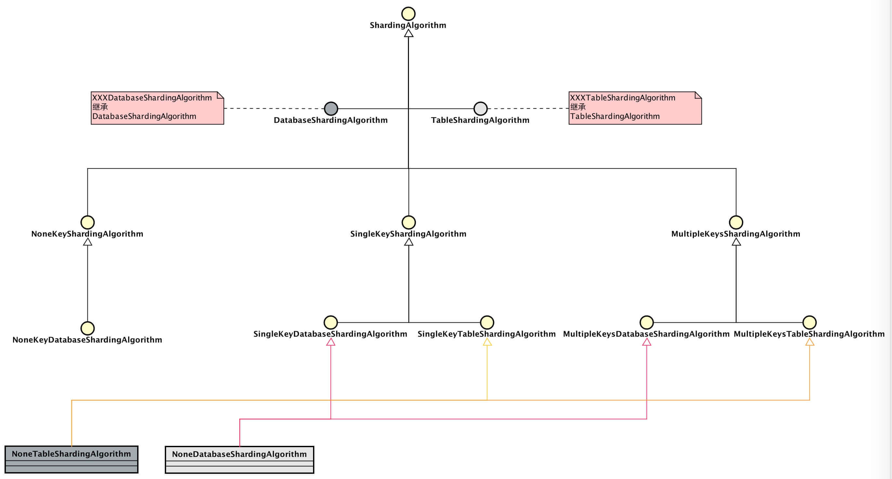
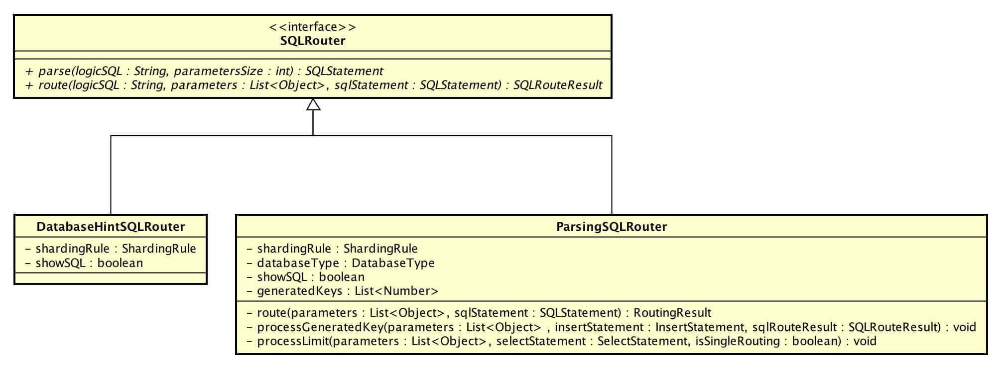
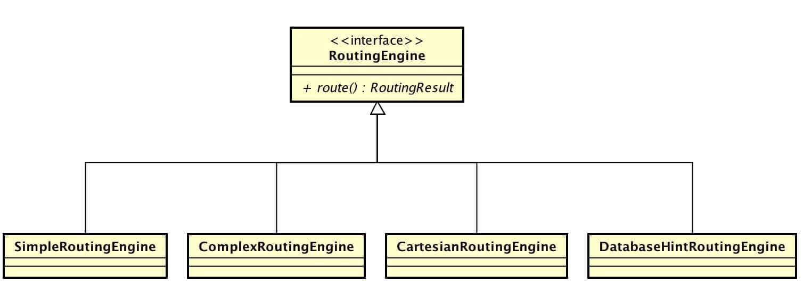

# 1. 概述

本文分享分表分库**路由**相关的实现。涉及内容如下：

1. SQL 路由结果
2. 路由策略 x 算法
3. SQL 路由器

内容顺序如编号。

> **Sharding-JDBC 正在收集使用公司名单：[传送门](https://github.com/dangdangdotcom/sharding-jdbc/issues/234)。  
> 🙂 你的登记，会让更多人参与和使用 Sharding-JDBC。[传送门](https://github.com/dangdangdotcom/sharding-jdbc/issues/234)  
> Sharding-JDBC 也会因此，能够覆盖更多的业务场景。[传送门](https://github.com/dangdangdotcom/sharding-jdbc/issues/234)  
> 登记吧，骚年！[传送门](https://github.com/dangdangdotcom/sharding-jdbc/issues/234)**

SQL 路由大体流程如下：


# 2. SQLRouteResult

经过 **SQL解析**、**SQL路由**后，产生**SQL路由结果**，即 SQLRouteResult。根据路由结果，**执行SQL**。


* `sqlStatement` ：SQL语句对象，经过**SQL解析**的结果对象。
* `executionUnits` ：SQL最小执行单元集合。**SQL执行**时，执行每个单元。
* `generatedKeys` ：**插入**SQL语句生成的主键编号集合。目前不支持批量插入而使用集合的原因，猜测是为了未来支持批量插入做准备。

# 3. 路由策略 x 算法


ShardingStrategy，分片策略。目前支持两种分片：  

*分片资源：在分库策略里指的是库，在分表策略里指的是表。*  

【1】 计算**静态**分片（常用）

```Java
// ShardingStrategy.java
/**
* 计算静态分片.
* @param sqlType SQL语句的类型
* @param availableTargetNames 所有的可用分片资源集合
* @param shardingValues 分片值集合
* @return 分库后指向的数据源名称集合
*/
public Collection<String> doStaticSharding(final SQLType sqlType, final Collection<String> availableTargetNames, final Collection<ShardingValue<?>> shardingValues) {
   Collection<String> result = new TreeSet<>(String.CASE_INSENSITIVE_ORDER);
   if (shardingValues.isEmpty()) {
       Preconditions.checkState(!isInsertMultiple(sqlType, availableTargetNames), "INSERT statement should contain sharding value."); // 插入不能有多资源对象
       result.addAll(availableTargetNames);
   } else {
       result.addAll(doSharding(shardingValues, availableTargetNames));
   }
   return result;
}
/**
* 插入SQL 是否插入多个分片
* @param sqlType SQL类型
* @param availableTargetNames 所有的可用分片资源集合
* @return 是否
*/
private boolean isInsertMultiple(final SQLType sqlType, final Collection<String> availableTargetNames) {
   return SQLType.INSERT == sqlType && availableTargetNames.size() > 1;
}   
```

* 插入SQL 需要有片键值，否则无法判断单个分片资源。*（Sharding-JDBC 目前仅支持单条记录插入）*

【2】计算**动态**分片

```Java
// ShardingStrategy.java
/**
* 计算动态分片.
* @param shardingValues 分片值集合
* @return 分库后指向的分片资源集合
*/
public Collection<String> doDynamicSharding(final Collection<ShardingValue<?>> shardingValues) {
   Preconditions.checkState(!shardingValues.isEmpty(), "Dynamic table should contain sharding value."); // 动态分片必须有分片值
   Collection<String> availableTargetNames = Collections.emptyList();
   Collection<String> result = new TreeSet<>(String.CASE_INSENSITIVE_ORDER);
   result.addAll(doSharding(shardingValues, availableTargetNames));
   return result;
}
```

* 动态分片对应 `TableRule.dynamic=true`
* 动态分片必须有分片值

😈 闷了，看起来两者没啥区别？答案在**分片算法**上。我们先看 `#doSharding()` 方法的实现。

```Java
// ShardingStrategy.java
/**
* 计算分片
* @param shardingValues 分片值集合
* @param availableTargetNames 所有的可用分片资源集合
* @return 分库后指向的分片资源集合
*/
private Collection<String> doSharding(final Collection<ShardingValue<?>> shardingValues, final Collection<String> availableTargetNames) {
   // 无片键
   if (shardingAlgorithm instanceof NoneKeyShardingAlgorithm) {
       return Collections.singletonList(((NoneKeyShardingAlgorithm) shardingAlgorithm).doSharding(availableTargetNames, shardingValues.iterator().next()));
   }
   // 单片键
   if (shardingAlgorithm instanceof SingleKeyShardingAlgorithm) {
       SingleKeyShardingAlgorithm<?> singleKeyShardingAlgorithm = (SingleKeyShardingAlgorithm<?>) shardingAlgorithm;
       ShardingValue shardingValue = shardingValues.iterator().next();
       switch (shardingValue.getType()) {
           case SINGLE:
               return Collections.singletonList(singleKeyShardingAlgorithm.doEqualSharding(availableTargetNames, shardingValue));
           case LIST:
               return singleKeyShardingAlgorithm.doInSharding(availableTargetNames, shardingValue);
           case RANGE:
               return singleKeyShardingAlgorithm.doBetweenSharding(availableTargetNames, shardingValue);
           default:
               throw new UnsupportedOperationException(shardingValue.getType().getClass().getName());
       }
   }
   // 多片键
   if (shardingAlgorithm instanceof MultipleKeysShardingAlgorithm) {
       return ((MultipleKeysShardingAlgorithm) shardingAlgorithm).doSharding(availableTargetNames, shardingValues);
   }
   throw new UnsupportedOperationException(shardingAlgorithm.getClass().getName());
}
```

* 无分片键算法：对应 NoneKeyShardingAlgorithm 分片算法接口。

```Java
public interface NoneKeyShardingAlgorithm<T extends Comparable<?>> extends ShardingAlgorithm {
    String doSharding(Collection<String> availableTargetNames, ShardingValue<T> shardingValue);
}
```

* 单片键算法：对应 SingleKeyShardingAlgorithm 分片算法接口。

```Java
public interface SingleKeyShardingAlgorithm<T extends Comparable<?>> extends ShardingAlgorithm {
    String doEqualSharding(Collection<String> availableTargetNames, ShardingValue<T> shardingValue);
    Collection<String> doInSharding(Collection<String> availableTargetNames, ShardingValue<T> shardingValue);
    Collection<String> doBetweenSharding(Collection<String> availableTargetNames, ShardingValue<T> shardingValue);
}
```


| ShardingValueType | SQL 操作符 | 接口方法 |
| :--- | :--- | :--- |
| SINGLE | = | `#doEqualSharding()` |
| LIST   | IN | `#doInSharding()` |
| RANGE  | BETWEEN | `#doBetweenSharding()` |

* 多片键算法：对应 MultipleKeysShardingAlgorithm 分片算法接口。

```Java
public interface MultipleKeysShardingAlgorithm extends ShardingAlgorithm {
    Collection<String> doSharding(Collection<String> availableTargetNames, Collection<ShardingValue<?>> shardingValues);
}
```

分片算法类结构如下：



来看看 Sharding-JDBC 实现的无需分库的分片算法 NoneDatabaseShardingAlgorithm (NoneTableShardingAlgorithm 基本一模一样)：

```Java
public final class NoneDatabaseShardingAlgorithm implements SingleKeyDatabaseShardingAlgorithm<String>, MultipleKeysDatabaseShardingAlgorithm { 
    @Override
    public Collection<String> doSharding(final Collection<String> availableTargetNames, final Collection<ShardingValue<?>> shardingValues) {
        return availableTargetNames;
    }
    @Override
    public String doEqualSharding(final Collection<String> availableTargetNames, final ShardingValue<String> shardingValue) {
        return availableTargetNames.isEmpty() ? null : availableTargetNames.iterator().next();
    }
    @Override
    public Collection<String> doInSharding(final Collection<String> availableTargetNames, final ShardingValue<String> shardingValue) {
        return availableTargetNames;
    }
    @Override
    public Collection<String> doBetweenSharding(final Collection<String> availableTargetNames, final ShardingValue<String> shardingValue) {
        return availableTargetNames;
    }
}
```

* **一定要注意，NoneXXXXShardingAlgorithm 只适用于无分库/表的需求，否则会是错误的路由结果。**

-------

再来看测试目录下实现的**余数基偶分表算法** ModuloTableShardingAlgorithm 的实现：

```Java
// com.dangdang.ddframe.rdb.integrate.fixture.ModuloTableShardingAlgorithm.java
public final class ModuloTableShardingAlgorithm implements SingleKeyTableShardingAlgorithm<Integer> {
    @Override
    public String doEqualSharding(final Collection<String> tableNames, final ShardingValue<Integer> shardingValue) {
        for (String each : tableNames) {
            if (each.endsWith(shardingValue.getValue() % 2 + "")) {
                return each;
            }
        }
        throw new UnsupportedOperationException();
    }
    @Override
    public Collection<String> doInSharding(final Collection<String> tableNames, final ShardingValue<Integer> shardingValue) {
        Collection<String> result = new LinkedHashSet<>(tableNames.size());
        for (Integer value : shardingValue.getValues()) {
            for (String tableName : tableNames) {
                if (tableName.endsWith(value % 2 + "")) {
                    result.add(tableName);
                }
            }
        }
        return result;
    }
    @Override
    public Collection<String> doBetweenSharding(final Collection<String> tableNames, final ShardingValue<Integer> shardingValue) {
        Collection<String> result = new LinkedHashSet<>(tableNames.size());
        Range<Integer> range = shardingValue.getValueRange();
        for (Integer i = range.lowerEndpoint(); i <= range.upperEndpoint(); i++) {
            for (String each : tableNames) {
                if (each.endsWith(i % 2 + "")) {
                    result.add(each);
                }
            }
        }
        return result;
    }
}
```

* 我们可以参考这个例子编写自己的分片算哟 👼。
* 多片键分库算法接口实现例子：[MultipleKeysModuloDatabaseShardingAlgorithm.java](https://github.com/dangdangdotcom/sharding-jdbc/blob/d6ac50704f5e45beeeded09a4f0b160c7320b993/sharding-jdbc-core/src/test/java/com/dangdang/ddframe/rdb/integrate/fixture/MultipleKeysModuloDatabaseShardingAlgorithm.java)

-------

😈 来看看**动态计算分片**需要怎么实现分片算法。

```Java
// com.dangdang.ddframe.rdb.integrate.fixture.SingleKeyDynamicModuloTableShardingAlgorithm.java
public final class SingleKeyDynamicModuloTableShardingAlgorithm implements SingleKeyTableShardingAlgorithm<Integer> {
    /**
    * 表前缀
    */
    private final String tablePrefix;
    @Override
    public String doEqualSharding(final Collection<String> availableTargetNames, final ShardingValue<Integer> shardingValue) {
        return tablePrefix + shardingValue.getValue() % 10;
    }
    @Override
    public Collection<String> doInSharding(final Collection<String> availableTargetNames, final ShardingValue<Integer> shardingValue) {
        Collection<String> result = new LinkedHashSet<>(shardingValue.getValues().size());
        for (Integer value : shardingValue.getValues()) {
            result.add(tablePrefix + value % 10);
        }
        return result;
    }
    @Override
    public Collection<String> doBetweenSharding(final Collection<String> availableTargetNames, final ShardingValue<Integer> shardingValue) {
        Collection<String> result = new LinkedHashSet<>(availableTargetNames.size());
        Range<Integer> range = shardingValue.getValueRange();
        for (Integer i = range.lowerEndpoint(); i <= range.upperEndpoint(); i++) {
            result.add(tablePrefix + i % 10);
        }
        return result;
    }
}
```
* 骚年，是不是明白了一些？**动态表**无需把真实表配置到 TableRule，而是通过**分片算法**计算出**真实表**。

# 4. SQL 路由

SQLRouter，SQL 路由器接口，共有两种实现：

* DatabaseHintSQLRouter：通过提示且仅路由至数据库的SQL路由器
* ParsingSQLRouter：需要解析的SQL路由器

它们实现 `#parse()`进行**SQL解析**，`#route()`进行**SQL路由**。



-------

RoutingEngine，路由引擎接口，共有四种实现：

* DatabaseHintRoutingEngine：基于数据库提示的路由引擎
* SimpleRoutingEngine：简单路由引擎
* CartesianRoutingEngine：笛卡尔积的库表路由
* ComplexRoutingEngine：混合多库表路由引擎

**ComplexRoutingEngine 根据路由结果会转化成 SimpleRoutingEngine 或 ComplexRoutingEngine**。下文会看相应源码。



-------

路由结果有两种：

* RoutingResult：简单路由结果
* CartesianRoutingResult：笛卡尔积路由结果


从图中，我们已经能大概看到两者有什么区别，更具体的下文随源码一起分享。

😈 SQLRouteResult 和 RoutingResult 有什么区别？

* SQLRouteResult：**整个SQL路由**返回的路由结果
* RoutingResult：**RoutingEngine**返回路由结果


-------

一下子看到这么多**“对象”**，可能有点**紧张**。不要紧张，我们一起在整理下。

| 路由器 | 路由引擎 | 路由结果 |
| :--- | :--- | :--- |
| DatabaseHintSQLRouter | DatabaseHintRoutingEngine | RoutingResult |
| ParsingSQLRouter | SimpleRoutingEngine | RoutingResult |
| ParsingSQLRouter | CartesianRoutingEngine | CartesianRoutingResult |

😈 _逗比博主给大家解决了**“对象”**，是不是应该**分享朋友圈**。_

# 5. DatabaseHintSQLRouter

# 6. ParsingSQLRouter

