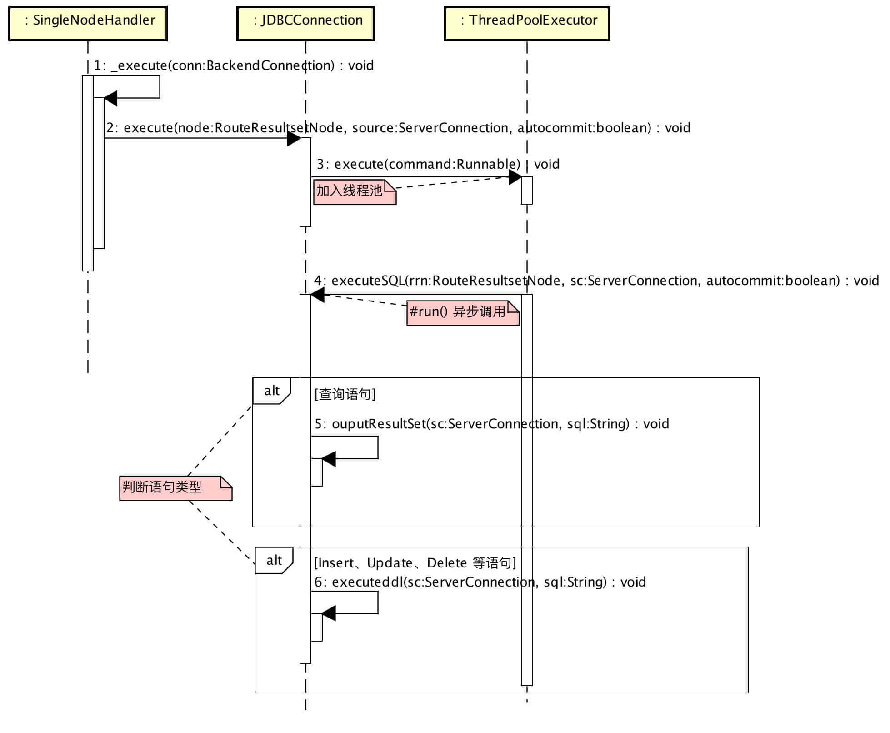
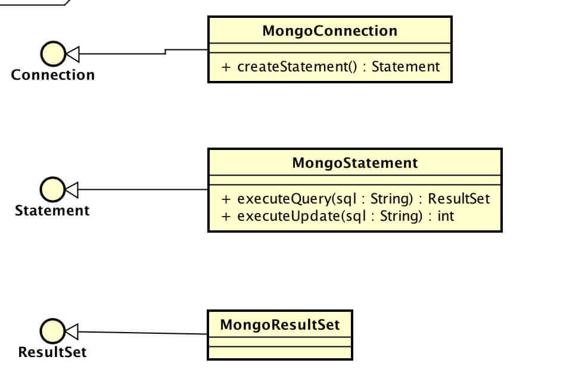
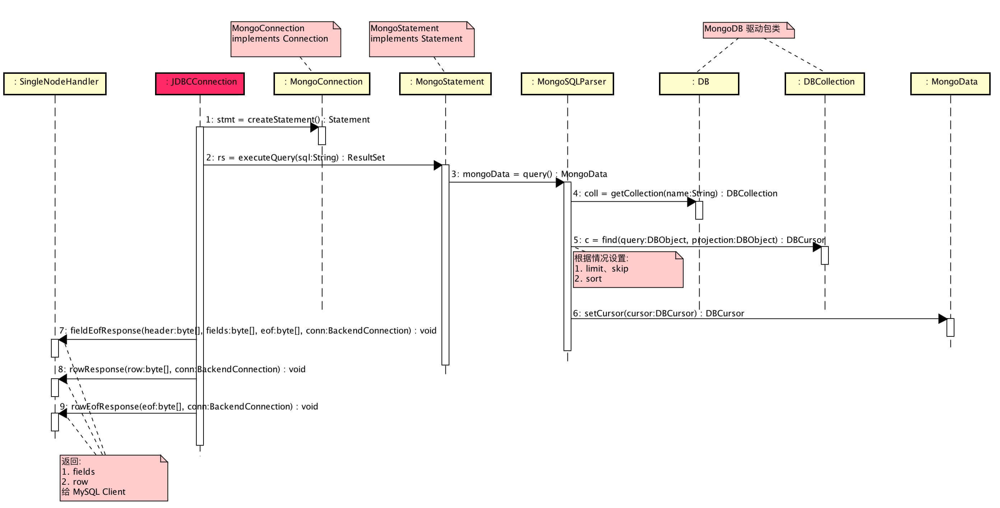
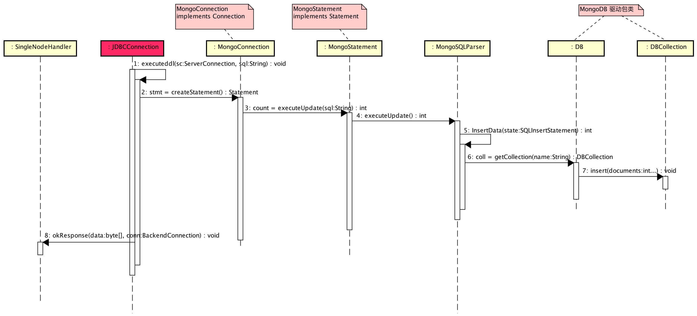

title: MyCAT源码分析  —— 我能连MongoDB
date: 2017-07-19
tags:
categories: MyCAT
permalink: MyCAT/connect-mongodb

---

>  原文地址：[http://www.yunai.me/MyCAT/connect-mongodb/](http://www.yunai.me/MyCAT/connect-mongodb/)  
> `MyCat-Server` **带注释代码**地址 ：[https://github.com/YunaiV/Mycat-Server](https://github.com/YunaiV/Mycat-Server)  
> **😈本系列每 1-2 周更新一篇，欢迎订阅、关注、收藏 公众号**  
> QQ ：7685413


-------

-------

# 1. 概述

可能你在看到这个标题会小小吃惊，MyCAT 能使用 MongoDB 做数据节点。是的，没错，确实可以。  
吼吼吼，让我们开启这段神奇的“旅途”。

本文主要分成四部分：

1. 总体流程，让你有个整体的认识
2. 查询操作
3. 插入操作
4. 彩蛋，😈彩蛋，🙂彩蛋

建议你看过之前的两篇文章（非必须）：

1. [《MyCAT 源码分析 —— 【单库单表】插入》](http://www.yunai.me/MyCAT/single-db-single-table-insert/?self)
2. [《MyCAT 源码分析 —— 【单库单表】查询》](http://www.yunai.me/MyCAT/single-db-single-table-select/?self)

# 2. 主流程

   

1. `MyCAT Server` 接收 `MySQL Client` 基于 **MySQL协议** 的请求，翻译 **SQL** 成 **MongoDB操作** 发送给 `MongoDB Server`。
2. `MyCAT Server` 接收 `MongoDB Server` 返回的 **MongoDB数据**，翻译成 `MySQL数据结果` 返回给 `MySQL Client`。

这样一看，MyCAT 连接 MongoDB 是不是少神奇一点列。

-------



> Java数据库连接，（Java Database Connectivity，简称JDBC）是Java语言中用来规范客户端程序如何来访问数据库的应用程序接口，提供了诸如查询和更新数据库中数据的方法。JDBC也是Sun Microsystems的商标。JDBC是面向关系型数据库的。

MyCAT 使用 JDBC 规范，抽象了对 MongoDB 的访问。通过这样的方式，MyCAT 也抽象了 SequoiaDB 的访问。可能这样说比较抽象，看个类图压压惊。



是不是熟悉的味道。**不得不说 JDBC 规范的精巧。**

# 3. 查询操作

```SQL
SELECT id, name FROM user WHERE name != null ORDER BY _id DESC;
```



看顺序图已经很方便的理解整体逻辑，我就不多废话啦。我们来看几个核心的代码逻辑。

**1、查询 MongoDB**

```Java
// MongoSQLParser.java
public MongoData query() throws MongoSQLException {
   if (!(statement instanceof SQLSelectStatement)) {
       //return null;
       throw new IllegalArgumentException("not a query sql statement");
   }
   MongoData mongo = new MongoData();
   DBCursor c = null;
   SQLSelectStatement selectStmt = (SQLSelectStatement) statement;
   SQLSelectQuery sqlSelectQuery = selectStmt.getSelect().getQuery();
   int icount = 0;
   if (sqlSelectQuery instanceof MySqlSelectQueryBlock) {
       MySqlSelectQueryBlock mysqlSelectQuery = (MySqlSelectQueryBlock) selectStmt.getSelect().getQuery();

       BasicDBObject fields = new BasicDBObject();

       // 显示（返回）的字段
       for (SQLSelectItem item : mysqlSelectQuery.getSelectList()) {
           //System.out.println(item.toString());
           if (!(item.getExpr() instanceof SQLAllColumnExpr)) {
               if (item.getExpr() instanceof SQLAggregateExpr) {
                   SQLAggregateExpr expr = (SQLAggregateExpr) item.getExpr();
                   if (expr.getMethodName().equals("COUNT")) { // TODO 待读：count（*）
                       icount = 1;
                       mongo.setField(getExprFieldName(expr), Types.BIGINT);
                   }
                   fields.put(getExprFieldName(expr), 1);
               } else {
                   fields.put(getFieldName(item), 1);
               }
           }

       }

       // 表名
       SQLTableSource table = mysqlSelectQuery.getFrom();
       DBCollection coll = this._db.getCollection(table.toString());
       mongo.setTable(table.toString());

       // WHERE
       SQLExpr expr = mysqlSelectQuery.getWhere();
       DBObject query = parserWhere(expr);

       // GROUP BY
       SQLSelectGroupByClause groupby = mysqlSelectQuery.getGroupBy();
       BasicDBObject gbkey = new BasicDBObject();
       if (groupby != null) {
           for (SQLExpr gbexpr : groupby.getItems()) {
               if (gbexpr instanceof SQLIdentifierExpr) {
                   String name = ((SQLIdentifierExpr) gbexpr).getName();
                   gbkey.put(name, Integer.valueOf(1));
               }
           }
           icount = 2;
       }

       // SKIP / LIMIT
       int limitoff = 0;
       int limitnum = 0;
       if (mysqlSelectQuery.getLimit() != null) {
           limitoff = getSQLExprToInt(mysqlSelectQuery.getLimit().getOffset());
           limitnum = getSQLExprToInt(mysqlSelectQuery.getLimit().getRowCount());
       }
       if (icount == 1) { // COUNT（*）
           mongo.setCount(coll.count(query));
       } else if (icount == 2) { // MapReduce
           BasicDBObject initial = new BasicDBObject();
           initial.put("num", 0);
           String reduce = "function (obj, prev) { " + "  prev.num++}";
           mongo.setGrouyBy(coll.group(gbkey, query, initial, reduce));
       } else {
           if ((limitoff > 0) || (limitnum > 0)) {
               c = coll.find(query, fields).skip(limitoff).limit(limitnum);
           } else {
               c = coll.find(query, fields);
           }

           // order by
           SQLOrderBy orderby = mysqlSelectQuery.getOrderBy();
           if (orderby != null) {
               BasicDBObject order = new BasicDBObject();
               for (int i = 0; i < orderby.getItems().size(); i++) {
                   SQLSelectOrderByItem orderitem = orderby.getItems().get(i);
                   order.put(orderitem.getExpr().toString(), getSQLExprToAsc(orderitem.getType()));
               }
               c.sort(order);
               // System.out.println(order);
           }
       }
       mongo.setCursor(c);
   }
   return mongo;
}
```

**2、查询条件**

```Java
// MongoSQLParser.java
private void parserWhere(SQLExpr aexpr, BasicDBObject o) {
   if (aexpr instanceof SQLBinaryOpExpr) {
       SQLBinaryOpExpr expr = (SQLBinaryOpExpr) aexpr;
       SQLExpr exprL = expr.getLeft();
       if (!(exprL instanceof SQLBinaryOpExpr)) {
           if (expr.getOperator().getName().equals("=")) {
               o.put(exprL.toString(), getExpValue(expr.getRight()));
           } else {
               String op = "";
               if (expr.getOperator().getName().equals("<")) {
                   op = "$lt";
               } else if (expr.getOperator().getName().equals("<=")) {
                   op = "$lte";
               } else if (expr.getOperator().getName().equals(">")) {
                   op = "$gt";
               } else if (expr.getOperator().getName().equals(">=")) {
                   op = "$gte";
               } else if (expr.getOperator().getName().equals("!=")) {
                   op = "$ne";
               } else if (expr.getOperator().getName().equals("<>")) {
                   op = "$ne";
               }
               parserDBObject(o, exprL.toString(), op, getExpValue(expr.getRight()));
           }
       } else {
           if (expr.getOperator().getName().equals("AND")) {
               parserWhere(exprL, o);
               parserWhere(expr.getRight(), o);
           } else if (expr.getOperator().getName().equals("OR")) {
               orWhere(exprL, expr.getRight(), o);
           } else {
               throw new RuntimeException("Can't identify the operation of  of where");
           }
       }
   }
}

private void orWhere(SQLExpr exprL, SQLExpr exprR, BasicDBObject ob) {
   BasicDBObject xo = new BasicDBObject();
   BasicDBObject yo = new BasicDBObject();
   parserWhere(exprL, xo);
   parserWhere(exprR, yo);
   ob.put("$or", new Object[]{xo, yo});
}
```

**3、解析 MongoDB 数据**

```Java
// MongoResultSet.java
public MongoResultSet(MongoData mongo, String schema) throws SQLException {
   this._cursor = mongo.getCursor();
   this._schema = schema;
   this._table = mongo.getTable();
   this.isSum = mongo.getCount() > 0;
   this._sum = mongo.getCount();
   this.isGroupBy = mongo.getType();

   if (this.isGroupBy) {
       dblist = mongo.getGrouyBys();
       this.isSum = true;
   }
   if (this._cursor != null) {
       select = _cursor.getKeysWanted().keySet().toArray(new String[0]);
       // 解析 fields
       if (this._cursor.hasNext()) {
           _cur = _cursor.next();
           if (_cur != null) {
               if (select.length == 0) {
                   SetFields(_cur.keySet());
               }
               _row = 1;
           }
       }
       // 设置 fields 类型
       if (select.length == 0) {
           select = new String[]{"_id"};
           SetFieldType(true);
       } else {
           SetFieldType(false);
       }
   } else {
       SetFields(mongo.getFields().keySet());//new String[]{"COUNT(*)"};
       SetFieldType(mongo.getFields());
   }
}
```

* 当使用 `SELECT *` 查询字段时，fields 使用第一条数据返回的 fields。即使，后面的数据有其他 fields，也不返回。

**4、返回数据给 MySQL Client**

```Java
// JDBCConnection.java
private void ouputResultSet(ServerConnection sc, String sql)
       throws SQLException {
   ResultSet rs = null;
   Statement stmt = null;

   try {
       stmt = con.createStatement();
       rs = stmt.executeQuery(sql);

       // header
       List<FieldPacket> fieldPks = new LinkedList<>();
       ResultSetUtil.resultSetToFieldPacket(sc.getCharset(), fieldPks, rs, this.isSpark);
       int colunmCount = fieldPks.size();
       ByteBuffer byteBuf = sc.allocate();
       ResultSetHeaderPacket headerPkg = new ResultSetHeaderPacket();
       headerPkg.fieldCount = fieldPks.size();
       headerPkg.packetId = ++packetId;
       byteBuf = headerPkg.write(byteBuf, sc, true);
       byteBuf.flip();
       byte[] header = new byte[byteBuf.limit()];
       byteBuf.get(header);
       byteBuf.clear();
       List<byte[]> fields = new ArrayList<byte[]>(fieldPks.size());
       for (FieldPacket curField : fieldPks) {
           curField.packetId = ++packetId;
           byteBuf = curField.write(byteBuf, sc, false);
           byteBuf.flip();
           byte[] field = new byte[byteBuf.limit()];
           byteBuf.get(field);
           byteBuf.clear();
           fields.add(field);
       }
       // header eof
       EOFPacket eofPckg = new EOFPacket();
       eofPckg.packetId = ++packetId;
       byteBuf = eofPckg.write(byteBuf, sc, false);
       byteBuf.flip();
       byte[] eof = new byte[byteBuf.limit()];
       byteBuf.get(eof);
       byteBuf.clear();
       this.respHandler.fieldEofResponse(header, fields, eof, this);

       // row
       while (rs.next()) {
           RowDataPacket curRow = new RowDataPacket(colunmCount);
           for (int i = 0; i < colunmCount; i++) {
               int j = i + 1;
               if (MysqlDefs.isBianry((byte) fieldPks.get(i).type)) {
                   curRow.add(rs.getBytes(j));
               } else if (fieldPks.get(i).type == MysqlDefs.FIELD_TYPE_DECIMAL ||
                       fieldPks.get(i).type == (MysqlDefs.FIELD_TYPE_NEW_DECIMAL - 256)) { // field type is unsigned byte
                   // ensure that do not use scientific notation format
                   BigDecimal val = rs.getBigDecimal(j);
                   curRow.add(StringUtil.encode(val != null ? val.toPlainString() : null, sc.getCharset()));
               } else {
                   curRow.add(StringUtil.encode(rs.getString(j), sc.getCharset()));
               }
           }
           curRow.packetId = ++packetId;
           byteBuf = curRow.write(byteBuf, sc, false);
           byteBuf.flip();
           byte[] row = new byte[byteBuf.limit()];
           byteBuf.get(row);
           byteBuf.clear();
           this.respHandler.rowResponse(row, this);
       }
       fieldPks.clear();
       // row eof
       eofPckg = new EOFPacket();
       eofPckg.packetId = ++packetId;
       byteBuf = eofPckg.write(byteBuf, sc, false);
       byteBuf.flip();
       eof = new byte[byteBuf.limit()];
       byteBuf.get(eof);
       sc.recycle(byteBuf);
       this.respHandler.rowEofResponse(eof, this);
   } finally {
       if (rs != null) {
           try {
               rs.close();
           } catch (SQLException e) {
           }
       }
       if (stmt != null) {
           try {
               stmt.close();
           } catch (SQLException e) {
           }
       }
   }
}

// MongoResultSet.java
@Override
public String getString(String columnLabel) throws SQLException {
   Object x = getObject(columnLabel);
   if (x == null) {
       return null;
   }
   return x.toString();
}
```

* 当返回字段值是 Object 时，返回该对象.toString()。例如：

```SQL
mysql> select * from user order by _id asc;
+--------------------------+------+-------------------------------+
| _id                      | name | profile                       |
+--------------------------+------+-------------------------------+
| 1                        | 123  | { "age" : 1 , "height" : 100} |
```

# 4. 插入操作



```Java
// MongoSQLParser.java
public int executeUpdate() throws MongoSQLException {
   if (statement instanceof SQLInsertStatement) {
       return InsertData((SQLInsertStatement) statement);
   }
   if (statement instanceof SQLUpdateStatement) {
       return UpData((SQLUpdateStatement) statement);
   }
   if (statement instanceof SQLDropTableStatement) {
       return dropTable((SQLDropTableStatement) statement);
   }
   if (statement instanceof SQLDeleteStatement) {
       return DeleteDate((SQLDeleteStatement) statement);
   }
   if (statement instanceof SQLCreateTableStatement) {
       return 1;
   }
   return 1;
}

private int InsertData(SQLInsertStatement state) {
   if (state.getValues().getValues().size() == 0) {
       throw new RuntimeException("number of  columns error");
   }
   if (state.getValues().getValues().size() != state.getColumns().size()) {
       throw new RuntimeException("number of values and columns have to match");
   }
   SQLTableSource table = state.getTableSource();
   BasicDBObject o = new BasicDBObject();
   int i = 0;
   for (SQLExpr col : state.getColumns()) {
       o.put(getFieldName2(col), getExpValue(state.getValues().getValues().get(i)));
       i++;
   }
   DBCollection coll = this._db.getCollection(table.toString());
   coll.insert(o);
   return 1;
}
```

# 5. 彩蛋

老铁，看到这里，来一波微信公众号关注吧？！


**1、支持多 MongoDB ，并使用 MyCAT 进行分片。**

MyCAT 配置：https://github.com/YunaiV/Mycat-Server/tree/1.6/src/test/resources/multi_mongodb

**2、支持 MongoDB + MySQL 作为同一个 MyCAT Table 的数据节点。查询时，可以合并数据结果。**

查询时，返回 MySQL 数据记录字段要比 MongoDB 数据记录字段全，否则，合并结果时会报错。

MyCAT 配置：https://github.com/YunaiV/Mycat-Server/tree/1.6/src/test/resources/single_mongodb_mysql

**3、MongoDB 作为数据节点时，可以使用 MyCAT 提供的数据库主键字段功能。**

MyCAT 配置：https://github.com/YunaiV/Mycat-Server/tree/1.6/src/test/resources/single_mongodb

