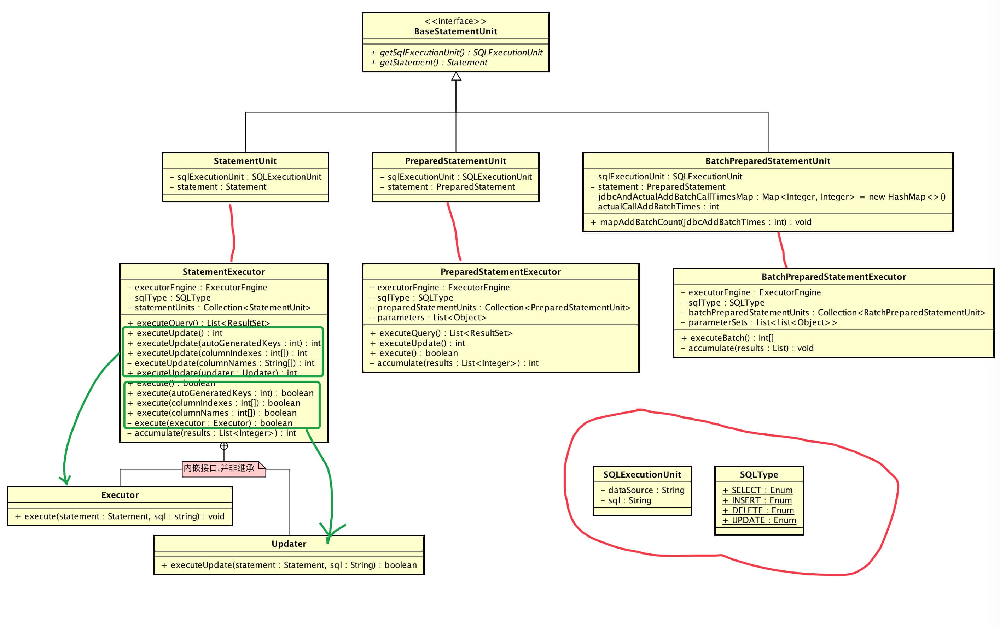
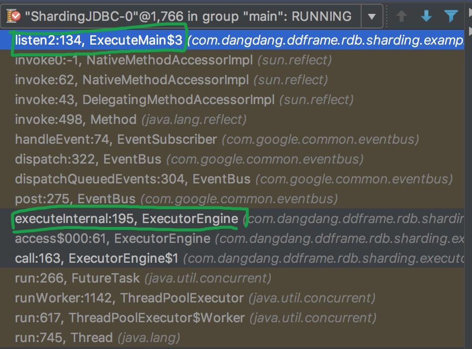

# 1. 概述

越过千山万水（SQL 解析、SQL 路由、SQL 改写），我们终于来到了 **SQL 执行**。开森不开森？！


本文主要分享**SQL 执行**的过程，不包括**结果聚合**。[《结果聚合》](http://www.yunai.me/images/common/wechat_mp_2017_07_31.jpg) **东半球第二良心笔者**会更新，关注微信公众号[【芋艿的后端小屋】](http://www.yunai.me/images/common/wechat_mp_2017_07_31.jpg)完稿后**第一时间**通知您哟。

# 2. ExecutorEngine

ExecutorEngine，SQL执行引擎。

分表分库，需要执行的 SQL 数量从单条变成了多条，此时有两种方式执行：

* **串行**执行 SQL
* 并行执行 SQL

前者，编码容易，性能较差，总耗时是多条 SQL 执行时间累加。  
后者，编码相对复杂，性能较好，总耗时约等于执行时间最长的 SQL。

👼 ExecutorEngine 当然采用的是**后者**，并行执行 SQL。

## 2.1 ListeningExecutorService

[Guava( Java 工具库 )](http://www.yiibai.com/guava/) 提供的继承自  ExecutorService 的**线程服务接口**，提供创建 ListenableFuture 功能。ListenableFuture 接口，继承 Future 接口，有如下好处：

> 我们强烈地建议你在代码中多使用ListenableFuture来代替JDK的 Future, 因为：  
> 
* 大多数Futures 方法中需要它。  
* 转到ListenableFuture 编程比较容易。  
* Guava提供的通用公共类封装了公共的操作方方法，不需要提供Future和ListenableFuture的扩展方法。  

> 传统JDK中的Future通过异步的方式计算返回结果:在多线程运算中可能或者可能在没有结束返回结果，Future是运行中的多线程的一个引用句柄，确保在服务执行返回一个Result。   

> ListenableFuture可以允许你注册回调方法(callbacks)，在运算（多线程执行）完成的时候进行调用,  或者在运算（多线程执行）完成后立即执行。这样简单的改进，使得可以明显的支持更多的操作，这样的功能在JDK concurrent中的Future是不支持的。

如上内容引用自 [《Google Guava包的ListenableFuture解析
》](http://ifeve.com/google-guava-listenablefuture/)，文章写的很棒。下文你会看到 Sharding-JDBC 是**如何通过 ListenableFuture 简化并发编程的**。

下面看看 Sharding-JDBC ListeningExecutorService 

```Java
// ShardingDataSource.java
public ShardingDataSource(final ShardingRule shardingRule, final Properties props) {
    // .... 省略部分代码
   shardingProperties = new ShardingProperties(props);
   int executorSize = shardingProperties.getValue(ShardingPropertiesConstant.EXECUTOR_SIZE);
   executorEngine = new ExecutorEngine(executorSize);
   // .... 省略部分代码
}

// ExecutorEngine
public ExecutorEngine(final int executorSize) {
   executorService = MoreExecutors.listeningDecorator(new ThreadPoolExecutor(
           executorSize, executorSize, 0, TimeUnit.MILLISECONDS, new LinkedBlockingQueue<Runnable>(),
           new ThreadFactoryBuilder().setDaemon(true).setNameFormat("ShardingJDBC-%d").build()));
   MoreExecutors.addDelayedShutdownHook(executorService, 60, TimeUnit.SECONDS);
}
```

* 一个分片数据源( ShardingDataSource ) **独占** 一个 SQL执行引擎( ExecutorEngine )。
* `MoreExecutors#listeningDecorator()` 创建 ListeningExecutorService，这样 `#submit()`，`#invokeAll()` 可以返回 ListenableFuture。
* 默认情况下，线程池大小为 **8**。可以根据实际业务需要，设置 ShardingProperties 进行调整。
* `#setNameFormat()` 并发编程时，一定要对线程名字做下定义，这样排查问题会方便很多。
* `MoreExecutors#addDelayedShutdownHook()`，**应用关闭**时，等待**所有任务全部完成**再关闭。默认配置等待时间为 60 秒，**建议**将等待时间做成可配的。

## 2.2 关闭

数据源关闭时，会调用 ExecutorEngine 也进行关闭。

```Java
// ShardingDataSource.java
@Override
public void close() {
   executorEngine.close();
}

// ExecutorEngine
@Override
public void close() {
   executorService.shutdownNow();
   try {
       executorService.awaitTermination(5, TimeUnit.SECONDS);
   } catch (final InterruptedException ignored) {
   }
   if (!executorService.isTerminated()) {
       throw new ShardingJdbcException("ExecutorEngine can not been terminated");
   }
}
```

* `#shutdownNow()` 尝试以 `Thread.interrupt()` 打断正在执行中的任务，未执行的任务不再执行。**建议**打印下哪些任务未执行，因为 SQL 未执行，可能数据未能持久化。
* `#awaitTermination()` 因为 `#shutdownNow()` 打断不是**立即**结束，需要一个过程，因此这里**等待**了 5 秒。
* **等待** 5 秒后，线程池不一定已经关闭，此时抛出异常给上层。**建议**打印下日志，记录出现这个情况。

## 2.3 执行 SQL 任务

ExecutorEngine 对外暴露 `#executeStatement()`，`#executePreparedStatement()`，`#executeBatch()` 

三个方法分别提供给 StatementExecutor、PreparedStatementExecutor、BatchPreparedStatementExecutor 调用。而这三个方法，内部调用的都是 `#execute()` 私有方法。

```Java
// ExecutorEngine.java
/**
* 执行Statement.
* @param sqlType SQL类型
* @param statementUnits 语句对象执行单元集合
* @param executeCallback 执行回调函数
* @param <T> 返回值类型
* @return 执行结果
*/
public <T> List<T> executeStatement(final SQLType sqlType, final Collection<StatementUnit> statementUnits, final ExecuteCallback<T> executeCallback) {
   return execute(sqlType, statementUnits, Collections.<List<Object>>emptyList(), executeCallback);
}
    
/**
* 执行PreparedStatement.
* @param sqlType SQL类型
* @param preparedStatementUnits 语句对象执行单元集合
* @param parameters 参数列表
* @param executeCallback 执行回调函数
* @param <T> 返回值类型
* @return 执行结果
*/
public <T> List<T> executePreparedStatement(
       final SQLType sqlType, final Collection<PreparedStatementUnit> preparedStatementUnits, final List<Object> parameters, final ExecuteCallback<T> executeCallback) {
   return execute(sqlType, preparedStatementUnits, Collections.singletonList(parameters), executeCallback);
}
    
/**
* 执行Batch.
* @param sqlType SQL类型
* @param batchPreparedStatementUnits 语句对象执行单元集合
* @param parameterSets 参数列表集
* @param executeCallback 执行回调函数
* @return 执行结果
*/
public List<int[]> executeBatch(
       final SQLType sqlType, final Collection<BatchPreparedStatementUnit> batchPreparedStatementUnits, final List<List<Object>> parameterSets, final ExecuteCallback<int[]> executeCallback) {
   return execute(sqlType, batchPreparedStatementUnits, parameterSets, executeCallback);
}
```

`#execute()` 执行过程大体流程如下图：


```Java
/**
* 执行
*
* @param sqlType SQL 类型
* @param baseStatementUnits 语句对象执行单元集合
* @param parameterSets 参数列表集
* @param executeCallback 执行回调函数
* @param <T> 返回值类型
* @return 执行结果
*/
private  <T> List<T> execute(
       final SQLType sqlType, final Collection<? extends BaseStatementUnit> baseStatementUnits, final List<List<Object>> parameterSets, final ExecuteCallback<T> executeCallback) {
   if (baseStatementUnits.isEmpty()) {
       return Collections.emptyList();
   }
   Iterator<? extends BaseStatementUnit> iterator = baseStatementUnits.iterator();
   BaseStatementUnit firstInput = iterator.next();
   // 第二个任务开始所有 SQL任务 提交线程池【异步】执行任务
   ListenableFuture<List<T>> restFutures = asyncExecute(sqlType, Lists.newArrayList(iterator), parameterSets, executeCallback);
   T firstOutput;
   List<T> restOutputs;
   try {
       // 第一个任务【同步】执行任务
       firstOutput = syncExecute(sqlType, firstInput, parameterSets, executeCallback);
       // 等待第二个任务开始所有 SQL任务完成
       restOutputs = restFutures.get();
       //CHECKSTYLE:OFF
   } catch (final Exception ex) {
       //CHECKSTYLE:ON
       ExecutorExceptionHandler.handleException(ex);
       return null;
   }
   // 返回结果
   List<T> result = Lists.newLinkedList(restOutputs);
   result.add(0, firstOutput);
   return result;
}
```

* 第一个任务**【同步】**调用 `#executeInternal()` 执行任务。

```Java
private <T> T syncExecute(final SQLType sqlType, final BaseStatementUnit baseStatementUnit, final List<List<Object>> parameterSets, final ExecuteCallback<T> executeCallback) throws Exception {
   // 【同步】执行任务
   return executeInternal(sqlType, baseStatementUnit, parameterSets, executeCallback, ExecutorExceptionHandler.isExceptionThrown(), ExecutorDataMap.getDataMap());
}
```

* 第二个开始的任务**提交线程池异步**调用 `#executeInternal()` 执行任务。

```Java
private <T> ListenableFuture<List<T>> asyncExecute(
       final SQLType sqlType, final Collection<BaseStatementUnit> baseStatementUnits, final List<List<Object>> parameterSets, final ExecuteCallback<T> executeCallback) {
   List<ListenableFuture<T>> result = new ArrayList<>(baseStatementUnits.size());
   final boolean isExceptionThrown = ExecutorExceptionHandler.isExceptionThrown();
   final Map<String, Object> dataMap = ExecutorDataMap.getDataMap();
   for (final BaseStatementUnit each : baseStatementUnits) {
       // 提交线程池【异步】执行任务
       result.add(executorService.submit(new Callable<T>() {
           
           @Override
           public T call() throws Exception {
               return executeInternal(sqlType, each, parameterSets, executeCallback, isExceptionThrown, dataMap);
           }
       }));
   }
   // 返回 ListenableFuture
   return Futures.allAsList(result);
}
```
* 我们注意下 `Futures.allAsList(result);` 和 `restOutputs = restFutures.get();`。神器 Guava **简化并发编程** 的好处就提现出来了。`ListenableFuture#get()` 当**所有任务都成功**时，返回所有任务执行结果；当**任何一个任务失败**时，**马上**抛出异常，无需等待其他任务执行完成。


_😮 Guava 真她喵神器，公众号：[【芋艿的后端小屋】](http://www.yunai.me/images/common/wechat_mp_2017_07_31.jpg)会更新 Guava 源码分享的一个系列哟！老司机还不赶紧上车？_

* 为什么会分同步执行和异步执行呢？猜测，当**SQL 执行是单表时**，只要进行第一个任务的同步调用，性能更加优秀。等跟张亮大神请教确认原因后，咱会进行更新。


```Java
// ExecutorEngine.java
private <T> T executeInternal(final SQLType sqlType, final BaseStatementUnit baseStatementUnit, final List<List<Object>> parameterSets, final ExecuteCallback<T> executeCallback, 
                     final boolean isExceptionThrown, final Map<String, Object> dataMap) throws Exception {
   synchronized (baseStatementUnit.getStatement().getConnection()) {
       T result;
       ExecutorExceptionHandler.setExceptionThrown(isExceptionThrown);
       ExecutorDataMap.setDataMap(dataMap);
       List<AbstractExecutionEvent> events = new LinkedList<>();
       // 生成 Event
       if (parameterSets.isEmpty()) {
           events.add(getExecutionEvent(sqlType, baseStatementUnit, Collections.emptyList()));
       } else {
           for (List<Object> each : parameterSets) {
               events.add(getExecutionEvent(sqlType, baseStatementUnit, each));
           }
       }
       // EventBus 发布 EventExecutionType.BEFORE_EXECUTE
       for (AbstractExecutionEvent event : events) {
           EventBusInstance.getInstance().post(event);
       }
       try {
           // 执行回调函数
           result = executeCallback.execute(baseStatementUnit);
       } catch (final SQLException ex) {
           // EventBus 发布 EventExecutionType.EXECUTE_FAILURE
           for (AbstractExecutionEvent each : events) {
               each.setEventExecutionType(EventExecutionType.EXECUTE_FAILURE);
               each.setException(Optional.of(ex));
               EventBusInstance.getInstance().post(each);
               ExecutorExceptionHandler.handleException(ex);
           }
           return null;
       }
       // EventBus 发布 EventExecutionType.EXECUTE_SUCCESS
       for (AbstractExecutionEvent each : events) {
           each.setEventExecutionType(EventExecutionType.EXECUTE_SUCCESS);
           EventBusInstance.getInstance().post(each);
       }
       return result;
   }
}
```

* `result = executeCallback.execute(baseStatementUnit);` 执行回调函数。StatementExecutor，PreparedStatementExecutor，BatchPreparedStatementExecutor 通过传递**执行回调函数**( ExecuteCallback )实现给 ExecutorEngine 实现并行执行。

```Java
public interface ExecuteCallback<T> {
    /**
     * 执行任务.
     * 
     * @param baseStatementUnit 语句对象执行单元
     * @return 处理结果
     * @throws Exception 执行期异常
     */
    T execute(BaseStatementUnit baseStatementUnit) throws Exception;
}
```

* `synchronized (baseStatementUnit.getStatement().getConnection())` 原以为 Connection 非线程安全，因此需要用**同步**，后翻查资料[《数据库连接池为什么要建立多个连接》](http://blog.csdn.net/goldenfish1919/article/details/9089667)，Connection 是线程安全的。等跟张亮大神请教确认原因后，咱会进行更新。
* ExecutionEvent 这里先不解释，在本文第四节【EventBus】分享。
* ExecutorExceptionHandler、ExecutorDataMap 和 柔性事务 ( AbstractSoftTransaction )，放在[《柔性事务》](http://www.yunai.me/images/common/wechat_mp_2017_07_31.jpg)分享。

# 3. Executor

Executor，执行器，目前一共有三个执行器。不同的执行器对应不同的执行单元 (BaseStatementUnit)。


| 执行器类 | 执行器名 | 执行单元 |
| :--- | :--- | :--- |
| StatementExecutor | 静态语句对象执行单元 | StatementUnit |
| PreparedStatementExecutor | 预编译语句对象请求的执行器 | PreparedStatementUnit |
| BatchPreparedStatementExecutor | 批量预编译语句对象请求的执行器 | BatchPreparedStatementUnit |

* 执行器提供的方法不同，因此不存在公用接口或者抽象类。
* 执行单元继承自 BaseStatementUnit



## 3.1 StatementExecutor

StatementExecutor，**多线程**执行静态语句对象请求的执行器，一共有三类方法：

* `#executeQuery()` 

```Java
// StatementExecutor.java
/**
* 执行SQL查询.
* @return 结果集列表
*/
public List<ResultSet> executeQuery() {
   Context context = MetricsContext.start("ShardingStatement-executeQuery");
   List<ResultSet> result;
   try {
       result = executorEngine.executeStatement(sqlType, statementUnits, new ExecuteCallback<ResultSet>() {
           @Override
           public ResultSet execute(final BaseStatementUnit baseStatementUnit) throws Exception {
               return baseStatementUnit.getStatement().executeQuery(baseStatementUnit.getSqlExecutionUnit().getSql());
           }
       });
   } finally {
       MetricsContext.stop(context);
   }
   return result;
}
```

* `#executeUpdate()` 因为有四个不同情况的`#executeUpdate()`，所以抽象了 Updater 接口，从而达到逻辑重用。

```Java
// StatementExecutor.java
/**
* 执行SQL更新.
* @return 更新数量
*/
public int executeUpdate() {
   return executeUpdate(new Updater() {
       @Override
       public int executeUpdate(final Statement statement, final String sql) throws SQLException {
           return statement.executeUpdate(sql);
       }
   });
}
private int executeUpdate(final Updater updater) {
   Context context = MetricsContext.start("ShardingStatement-executeUpdate");
   try {
       List<Integer> results = executorEngine.executeStatement(sqlType, statementUnits, new ExecuteCallback<Integer>() {
           @Override
           public Integer execute(final BaseStatementUnit baseStatementUnit) throws Exception {
               return updater.executeUpdate(baseStatementUnit.getStatement(), baseStatementUnit.getSqlExecutionUnit().getSql());
           }
       });
       return accumulate(results);
   } finally {
       MetricsContext.stop(context);
   }
}
/**
* 计算总的更新数量
* @param results 更新数量数组
* @return 更新数量
*/
private int accumulate(final List<Integer> results) {
   int result = 0;
   for (Integer each : results) {
       result += null == each ? 0 : each;
   }
   return result;
}
```

* `#execute()` 因为有四个不同情况的`#execute()`，所以抽象了 Executor 接口，从而达到逻辑重用。

```Java
/**
* 执行SQL请求.
* @return true表示执行DQL语句, false表示执行的DML语句
*/
public boolean execute() {
   return execute(new Executor() {
       
       @Override
       public boolean execute(final Statement statement, final String sql) throws SQLException {
           return statement.execute(sql);
       }
   });
}
private boolean execute(final Executor executor) {
   Context context = MetricsContext.start("ShardingStatement-execute");
   try {
       List<Boolean> result = executorEngine.executeStatement(sqlType, statementUnits, new ExecuteCallback<Boolean>() { 
           @Override
           public Boolean execute(final BaseStatementUnit baseStatementUnit) throws Exception {
               return executor.execute(baseStatementUnit.getStatement(), baseStatementUnit.getSqlExecutionUnit().getSql());
           }
       });
       if (null == result || result.isEmpty() || null == result.get(0)) {
           return false;
       }
       return result.get(0);
   } finally {
       MetricsContext.stop(context);
   }
}
```

## 3.2 PreparedStatementExecutor

PreparedStatementExecutor，**多线程**执行预编译语句对象请求的执行器。比 StatementExecutor 多了 `parameters` 参数，方法逻辑上基本一致，就不重复分享啦。

## 3.3 BatchPreparedStatementExecutor

BatchPreparedStatementExecutor，**多线程**执行批量预编译语句对象请求的执行器。

```Java
// BatchPreparedStatementExecutor.java
/**
* 执行批量SQL.
* 
* @return 执行结果
*/
public int[] executeBatch() {
   Context context = MetricsContext.start("ShardingPreparedStatement-executeBatch");
   try {
       return accumulate(executorEngine.executeBatch(sqlType, batchPreparedStatementUnits, parameterSets, new ExecuteCallback<int[]>() {
           
           @Override
           public int[] execute(final BaseStatementUnit baseStatementUnit) throws Exception {
               return baseStatementUnit.getStatement().executeBatch();
           }
       }));
   } finally {
       MetricsContext.stop(context);
   }
}
/**
* 计算每个语句的更新数量
*
* @param results 每条 SQL 更新数量
* @return 每个语句的更新数量
*/
private int[] accumulate(final List<int[]> results) {
   int[] result = new int[parameterSets.size()];
   int count = 0;
   // 每个语句按照顺序，读取到其对应的每个分片SQL影响的行数进行累加
   for (BatchPreparedStatementUnit each : batchPreparedStatementUnits) {
       for (Map.Entry<Integer, Integer> entry : each.getJdbcAndActualAddBatchCallTimesMap().entrySet()) {
           result[entry.getKey()] += null == results.get(count) ? 0 : results.get(count)[entry.getValue()];
       }
       count++;
   }
   return result;
}
```

**眼尖**的同学会发现，为什么有 BatchPreparedStatementExecutor，而没有 BatchStatementExecutor 呢？目前 Sharding-JDBC 不支持 Statement 批量操作，只能进行 PreparedStatement 的批操作。


```Java
// PreparedStatement 批量操作，不会报错
PreparedStatement ps = conn.prepareStatement(sql)
ps.addBatch();
ps.addBatch();

// Statement 批量操作，会报错
ps.addBatch(sql); // 报错：at com.dangdang.ddframe.rdb.sharding.jdbc.unsupported.AbstractUnsupportedOperationStatement.addBatch
```

# 4. ExecutionEvent

AbstractExecutionEvent，SQL 执行事件抽象接口。

```Java
public abstract class AbstractExecutionEvent {
    /**
     * 事件编号
     */
    private final String id;
    /**
     * 数据源
     */
    private final String dataSource;
    /**
     * SQL
     */
    private final String sql;
    /**
     * 参数
     */
    private final List<Object> parameters;
    /**
     * 事件类型
     */
    private EventExecutionType eventExecutionType;
    /**
     * 异常
     */
    private Optional<SQLException> exception;
}
```

AbstractExecutionEvent 有两个实现子类：

* DMLExecutionEvent：DML类SQL执行时事件
* DQLExecutionEvent：DQL类SQL执行时事件

EventExecutionType，事件触发类型。

* BEFORE_EXECUTE：执行前
* EXECUTE_SUCCESS：执行成功
* EXECUTE_FAILURE：执行失败

## 4.1 EventBus

**那究竟有什么用途呢？** Sharding-JDBC 使用 Guava（**没错，又是它**）的 **EventBus** 实现了**事件的发布和订阅**。从上文 `ExecutorEngine#executeInternal()` 我们可以看到**每个分片** SQL 执行的过程中会发布相应事件：

* 执行 SQL 前：发布类型类型为 BEFORE_EXECUTE 的事件
* 执行 SQL 成功：发布类型类型为 EXECUTE_SUCCESS 的事件
* 执行 SQL 失败：发布类型类型为 EXECUTE_FAILURE 的事件

**怎么订阅事件呢？**非常简单，例子如下：

```Java
EventBusInstance.getInstance().register(new Runnable() {

  @Override
  public void run() {
  }

  @Subscribe // 订阅
  @AllowConcurrentEvents // 是否允许并发执行，即线程安全
  public void listen(final DMLExecutionEvent event) { // DMLExecutionEvent
      System.out.println("DMLExecutionEvent：" + event.getSql() + "\t" + event.getEventExecutionType());
  }

  @Subscribe // 订阅
  @AllowConcurrentEvents // 是否允许并发执行，即线程安全
  public void listen2(final DQLExecutionEvent event) { //DQLExecutionEvent
      System.out.println("DQLExecutionEvent：" + event.getSql() + "\t" + event.getEventExecutionType());
  }

});
```

* `#register()` 任何类都可以，并非一定需要使用 Runnable 类。此处例子单纯因为方便
* `@Subscribe` 注解在方法上，实现对事件的订阅
* `@AllowConcurrentEvents` 注解在方法上，表示线程安全，允许并发执行
* 方法上的**参数对应的类**即是订阅的事件。例如，`#listen()` 订阅了 DMLExecutionEvent 事件
* `EventBus#post()` 发布事件，**同步**调用订阅逻辑



## 4.2 BestEffortsDeliveryListener

BestEffortsDeliveryListener，最大努力送达型事务监听器。

本文暂时暂时不分析其实现，仅仅作为另外一个**订阅者**的例子。我们会在[《荣幸事务》](http://www.yunai.me/images/common/wechat_mp_2017_07_31.jpg)进行分享。

```Java
public final class BestEffortsDeliveryListener {
    @Subscribe
    @AllowConcurrentEvents
    public void listen(final DMLExecutionEvent event) {
        if (!isProcessContinuously()) {
            return;
        }
        SoftTransactionConfiguration transactionConfig = SoftTransactionManager.getCurrentTransactionConfiguration().get();
        TransactionLogStorage transactionLogStorage = TransactionLogStorageFactory.createTransactionLogStorage(transactionConfig.buildTransactionLogDataSource());
        BEDSoftTransaction bedSoftTransaction = (BEDSoftTransaction) SoftTransactionManager.getCurrentTransaction().get();
        switch (event.getEventExecutionType()) {
            case BEFORE_EXECUTE:
                //TODO 对于批量执行的SQL需要解析成两层列表
                transactionLogStorage.add(new TransactionLog(event.getId(), bedSoftTransaction.getTransactionId(), bedSoftTransaction.getTransactionType(), 
                        event.getDataSource(), event.getSql(), event.getParameters(), System.currentTimeMillis(), 0));
                return;
            case EXECUTE_SUCCESS: 
                transactionLogStorage.remove(event.getId());
                return;
            case EXECUTE_FAILURE: 
                boolean deliverySuccess = false;
                for (int i = 0; i < transactionConfig.getSyncMaxDeliveryTryTimes(); i++) {
                    if (deliverySuccess) {
                        return;
                    }
                    boolean isNewConnection = false;
                    Connection conn = null;
                    PreparedStatement preparedStatement = null;
                    try {
                        conn = bedSoftTransaction.getConnection().getConnection(event.getDataSource(), SQLType.UPDATE);
                        if (!isValidConnection(conn)) {
                            bedSoftTransaction.getConnection().release(conn);
                            conn = bedSoftTransaction.getConnection().getConnection(event.getDataSource(), SQLType.UPDATE);
                            isNewConnection = true;
                        }
                        preparedStatement = conn.prepareStatement(event.getSql());
                        //TODO 对于批量事件需要解析成两层列表
                        for (int parameterIndex = 0; parameterIndex < event.getParameters().size(); parameterIndex++) {
                            preparedStatement.setObject(parameterIndex + 1, event.getParameters().get(parameterIndex));
                        }
                        preparedStatement.executeUpdate();
                        deliverySuccess = true;
                        transactionLogStorage.remove(event.getId());
                    } catch (final SQLException ex) {
                        log.error(String.format("Delivery times %s error, max try times is %s", i + 1, transactionConfig.getSyncMaxDeliveryTryTimes()), ex);
                    } finally {
                        close(isNewConnection, conn, preparedStatement);
                    }
                }
                return;
            default: 
                throw new UnsupportedOperationException(event.getEventExecutionType().toString());
        }
    }
}
```

# 666. 彩蛋


